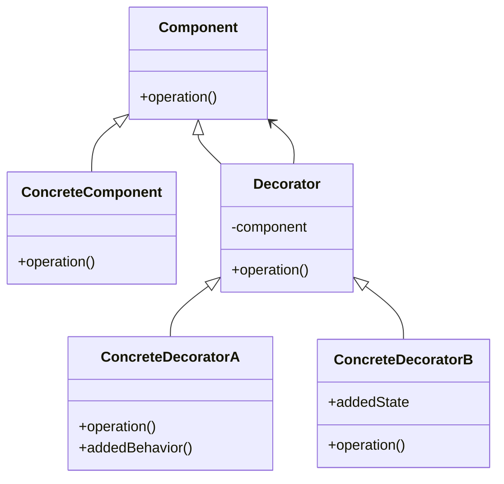
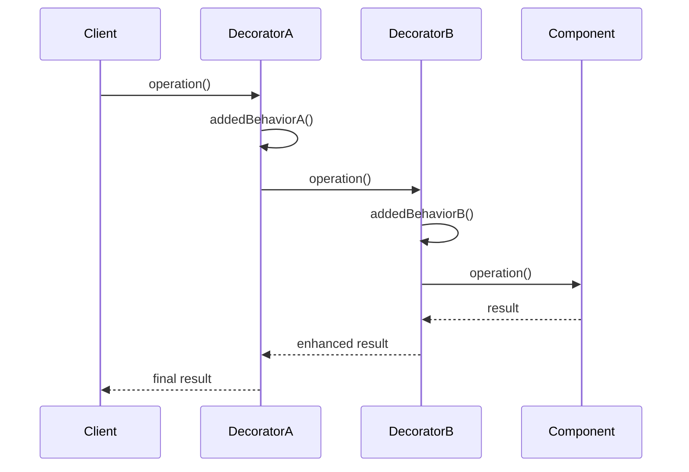

# 装饰器模式 (Decorator Pattern)

## 概述

装饰器模式允许向一个现有的对象添加新的功能，同时又不改变其结构。这种类型的设计模式属于结构型模式，它是作为现有的类的一个包装。

## 问题场景

在Laravel应用中，我们经常需要为对象动态地添加功能，如：
- 为HTTP响应添加缓存、压缩、加密等功能
- 为数据库查询添加日志记录、缓存、性能监控
- 为文本添加格式化、验证、转换等处理
- 为用户添加不同的权限、角色、功能

## 解决方案

装饰器模式通过创建一个装饰类，用来包装原有的类，并在保持类方法签名完整性的前提下，提供了额外的功能。

## UML类图



## Laravel实现

### 1. HTTP响应装饰器示例

```php
<?php

namespace App\Patterns\Decorator;

// 响应组件接口
interface ResponseComponent
{
    public function getContent(): string;
    public function getHeaders(): array;
}

// 基础HTTP响应
class HttpResponse implements ResponseComponent
{
    private string $content;
    private array $headers;
    
    public function __construct(string $content, array $headers = [])
    {
        $this->content = $content;
        $this->headers = $headers;
    }
    
    public function getContent(): string
    {
        return $this->content;
    }
    
    public function getHeaders(): array
    {
        return $this->headers;
    }
}

// 响应装饰器基类
abstract class ResponseDecorator implements ResponseComponent
{
    protected ResponseComponent $response;
    
    public function __construct(ResponseComponent $response)
    {
        $this->response = $response;
    }
    
    public function getContent(): string
    {
        return $this->response->getContent();
    }
    
    public function getHeaders(): array
    {
        return $this->response->getHeaders();
    }
}

// 压缩装饰器
class GzipResponseDecorator extends ResponseDecorator
{
    public function getContent(): string
    {
        return gzencode($this->response->getContent());
    }
    
    public function getHeaders(): array
    {
        $headers = $this->response->getHeaders();
        $headers['Content-Encoding'] = 'gzip';
        return $headers;
    }
}

// 缓存装饰器
class CacheResponseDecorator extends ResponseDecorator
{
    private int $maxAge;
    
    public function __construct(ResponseComponent $response, int $maxAge = 3600)
    {
        parent::__construct($response);
        $this->maxAge = $maxAge;
    }
    
    public function getHeaders(): array
    {
        $headers = $this->response->getHeaders();
        $headers['Cache-Control'] = "max-age={$this->maxAge}";
        $headers['Expires'] = gmdate('D, d M Y H:i:s', time() + $this->maxAge) . ' GMT';
        return $headers;
    }
}

// JSON装饰器
class JsonResponseDecorator extends ResponseDecorator
{
    public function getContent(): string
    {
        $content = $this->response->getContent();
        
        // 如果内容已经是JSON，直接返回
        if (json_decode($content) !== null) {
            return $content;
        }
        
        // 否则转换为JSON
        return json_encode(['data' => $content]);
    }
    
    public function getHeaders(): array
    {
        $headers = $this->response->getHeaders();
        $headers['Content-Type'] = 'application/json';
        return $headers;
    }
}

// CORS装饰器
class CorsResponseDecorator extends ResponseDecorator
{
    private array $allowedOrigins;
    private array $allowedMethods;
    
    public function __construct(
        ResponseComponent $response,
        array $allowedOrigins = ['*'],
        array $allowedMethods = ['GET', 'POST', 'PUT', 'DELETE']
    ) {
        parent::__construct($response);
        $this->allowedOrigins = $allowedOrigins;
        $this->allowedMethods = $allowedMethods;
    }
    
    public function getHeaders(): array
    {
        $headers = $this->response->getHeaders();
        $headers['Access-Control-Allow-Origin'] = implode(', ', $this->allowedOrigins);
        $headers['Access-Control-Allow-Methods'] = implode(', ', $this->allowedMethods);
        $headers['Access-Control-Allow-Headers'] = 'Content-Type, Authorization';
        return $headers;
    }
}
```

### 2. 数据库查询装饰器示例

```php
<?php

namespace App\Patterns\Decorator;

// 查询接口
interface QueryInterface
{
    public function execute(): array;
    public function getSql(): string;
}

// 基础查询类
class DatabaseQuery implements QueryInterface
{
    private string $sql;
    private array $bindings;
    
    public function __construct(string $sql, array $bindings = [])
    {
        $this->sql = $sql;
        $this->bindings = $bindings;
    }
    
    public function execute(): array
    {
        // 模拟数据库查询
        return \DB::select($this->sql, $this->bindings);
    }
    
    public function getSql(): string
    {
        return $this->sql;
    }
}

// 查询装饰器基类
abstract class QueryDecorator implements QueryInterface
{
    protected QueryInterface $query;
    
    public function __construct(QueryInterface $query)
    {
        $this->query = $query;
    }
    
    public function execute(): array
    {
        return $this->query->execute();
    }
    
    public function getSql(): string
    {
        return $this->query->getSql();
    }
}

// 日志装饰器
class LoggingQueryDecorator extends QueryDecorator
{
    public function execute(): array
    {
        $startTime = microtime(true);
        $sql = $this->query->getSql();
        
        \Log::info("Executing query: {$sql}");
        
        try {
            $result = $this->query->execute();
            $executionTime = microtime(true) - $startTime;
            
            \Log::info("Query executed successfully", [
                'sql' => $sql,
                'execution_time' => $executionTime,
                'result_count' => count($result)
            ]);
            
            return $result;
        } catch (\Exception $e) {
            \Log::error("Query execution failed", [
                'sql' => $sql,
                'error' => $e->getMessage()
            ]);
            throw $e;
        }
    }
}

// 缓存装饰器
class CachingQueryDecorator extends QueryDecorator
{
    private int $ttl;
    private string $cacheKey;
    
    public function __construct(QueryInterface $query, int $ttl = 3600, string $cacheKey = null)
    {
        parent::__construct($query);
        $this->ttl = $ttl;
        $this->cacheKey = $cacheKey ?: md5($query->getSql());
    }
    
    public function execute(): array
    {
        // 尝试从缓存获取结果
        $result = \Cache::get($this->cacheKey);
        
        if ($result !== null) {
            \Log::debug("Query result retrieved from cache", ['cache_key' => $this->cacheKey]);
            return $result;
        }
        
        // 缓存未命中，执行查询
        $result = $this->query->execute();
        
        // 将结果存储到缓存
        \Cache::put($this->cacheKey, $result, $this->ttl);
        \Log::debug("Query result cached", ['cache_key' => $this->cacheKey, 'ttl' => $this->ttl]);
        
        return $result;
    }
}

// 性能监控装饰器
class ProfilingQueryDecorator extends QueryDecorator
{
    public function execute(): array
    {
        $startTime = microtime(true);
        $startMemory = memory_get_usage();
        
        $result = $this->query->execute();
        
        $executionTime = microtime(true) - $startTime;
        $memoryUsage = memory_get_usage() - $startMemory;
        
        // 记录性能指标
        \Log::info("Query performance metrics", [
            'sql' => $this->query->getSql(),
            'execution_time' => round($executionTime * 1000, 2) . 'ms',
            'memory_usage' => round($memoryUsage / 1024, 2) . 'KB',
            'result_count' => count($result)
        ]);
        
        // 如果执行时间过长，发出警告
        if ($executionTime > 1.0) {
            \Log::warning("Slow query detected", [
                'sql' => $this->query->getSql(),
                'execution_time' => $executionTime
            ]);
        }
        
        return $result;
    }
}
```

### 3. 文本处理装饰器示例

```php
<?php

namespace App\Patterns\Decorator;

// 文本处理接口
interface TextProcessor
{
    public function process(string $text): string;
}

// 基础文本处理器
class PlainTextProcessor implements TextProcessor
{
    public function process(string $text): string
    {
        return $text;
    }
}

// 文本装饰器基类
abstract class TextDecorator implements TextProcessor
{
    protected TextProcessor $processor;
    
    public function __construct(TextProcessor $processor)
    {
        $this->processor = $processor;
    }
    
    public function process(string $text): string
    {
        return $this->processor->process($text);
    }
}

// HTML转义装饰器
class HtmlEscapeDecorator extends TextDecorator
{
    public function process(string $text): string
    {
        $text = $this->processor->process($text);
        return htmlspecialchars($text, ENT_QUOTES, 'UTF-8');
    }
}

// Markdown装饰器
class MarkdownDecorator extends TextDecorator
{
    public function process(string $text): string
    {
        $text = $this->processor->process($text);
        
        // 简单的Markdown处理
        $text = preg_replace('/\*\*(.*?)\*\*/', '<strong>$1</strong>', $text);
        $text = preg_replace('/\*(.*?)\*/', '<em>$1</em>', $text);
        $text = preg_replace('/`(.*?)`/', '<code>$1</code>', $text);
        $text = preg_replace('/\n\n/', '</p><p>', $text);
        
        return '<p>' . $text . '</p>';
    }
}

// 链接转换装饰器
class LinkifyDecorator extends TextDecorator
{
    public function process(string $text): string
    {
        $text = $this->processor->process($text);
        
        // 将URL转换为链接
        $pattern = '/(https?:\/\/[^\s]+)/';
        $replacement = '<a href="$1" target="_blank">$1</a>';
        
        return preg_replace($pattern, $replacement, $text);
    }
}

// 敏感词过滤装饰器
class ProfanityFilterDecorator extends TextDecorator
{
    private array $bannedWords;
    
    public function __construct(TextProcessor $processor, array $bannedWords = [])
    {
        parent::__construct($processor);
        $this->bannedWords = $bannedWords ?: ['敏感词1', '敏感词2'];
    }
    
    public function process(string $text): string
    {
        $text = $this->processor->process($text);
        
        foreach ($this->bannedWords as $word) {
            $replacement = str_repeat('*', mb_strlen($word));
            $text = str_replace($word, $replacement, $text);
        }
        
        return $text;
    }
}

// 字符限制装饰器
class TruncateDecorator extends TextDecorator
{
    private int $maxLength;
    private string $suffix;
    
    public function __construct(TextProcessor $processor, int $maxLength = 100, string $suffix = '...')
    {
        parent::__construct($processor);
        $this->maxLength = $maxLength;
        $this->suffix = $suffix;
    }
    
    public function process(string $text): string
    {
        $text = $this->processor->process($text);
        
        if (mb_strlen($text) > $this->maxLength) {
            return mb_substr($text, 0, $this->maxLength - mb_strlen($this->suffix)) . $this->suffix;
        }
        
        return $text;
    }
}
```

## 使用示例

### HTTP响应装饰器使用

```php
<?php

// 创建基础响应
$response = new HttpResponse('<h1>Hello World</h1>', ['Content-Type' => 'text/html']);

// 添加多层装饰
$decoratedResponse = new CorsResponseDecorator(
    new CacheResponseDecorator(
        new GzipResponseDecorator($response),
        7200
    ),
    ['https://example.com'],
    ['GET', 'POST']
);

// 获取最终内容和头部
$content = $decoratedResponse->getContent();
$headers = $decoratedResponse->getHeaders();

// 输出响应
foreach ($headers as $name => $value) {
    header("{$name}: {$value}");
}
echo $content;
```

### 数据库查询装饰器使用

```php
<?php

// 创建基础查询
$query = new DatabaseQuery('SELECT * FROM users WHERE active = ?', [1]);

// 添加装饰器
$decoratedQuery = new ProfilingQueryDecorator(
    new LoggingQueryDecorator(
        new CachingQueryDecorator($query, 1800)
    )
);

// 执行查询
$results = $decoratedQuery->execute();
```

### 文本处理装饰器使用

```php
<?php

// 创建基础处理器
$processor = new PlainTextProcessor();

// 添加多层装饰
$decoratedProcessor = new TruncateDecorator(
    new LinkifyDecorator(
        new MarkdownDecorator(
            new ProfanityFilterDecorator(
                new HtmlEscapeDecorator($processor)
            )
        )
    ),
    200
);

// 处理文本
$input = "这是一个**重要**的消息，访问 https://example.com 了解更多。";
$output = $decoratedProcessor->process($input);
echo $output;
```

## Laravel中的实际应用

### 1. 中间件系统

Laravel的中间件就是装饰器模式的典型应用：

```php
<?php

// 中间件装饰HTTP请求处理
class AuthMiddleware
{
    public function handle($request, Closure $next)
    {
        if (!auth()->check()) {
            return redirect('login');
        }
        
        return $next($request); // 装饰模式的核心
    }
}

class CorsMiddleware
{
    public function handle($request, Closure $next)
    {
        $response = $next($request);
        
        $response->headers->set('Access-Control-Allow-Origin', '*');
        
        return $response;
    }
}
```

### 2. 缓存装饰器

```php
<?php

// Laravel的缓存系统使用装饰器模式
Cache::remember('users', 3600, function () {
    return User::all();
});

// 等同于装饰器模式的实现
class CacheDecorator
{
    private $store;
    private $ttl;
    
    public function get($key, Closure $callback)
    {
        $result = $this->store->get($key);
        
        if ($result === null) {
            $result = $callback();
            $this->store->put($key, $result, $this->ttl);
        }
        
        return $result;
    }
}
```

### 3. 事件装饰器

```php
<?php

// 为模型操作添加事件装饰
class EventDecorator
{
    private $model;
    
    public function save()
    {
        event('model.saving', $this->model);
        $result = $this->model->save();
        event('model.saved', $this->model);
        
        return $result;
    }
}
```

## 时序图



## 优点

1. **动态扩展功能**：可以在运行时为对象添加功能
2. **遵循开闭原则**：对扩展开放，对修改关闭
3. **灵活组合**：可以通过不同的装饰器组合创建不同的行为
4. **单一职责**：每个装饰器只负责一个特定的功能

## 缺点

1. **增加复杂性**：会产生很多小的装饰类
2. **调试困难**：多层装饰可能使调试变得复杂
3. **性能开销**：多层装饰会带来一定的性能损失

## 适用场景

1. **需要动态地给对象添加功能**
2. **不能通过继承来扩展功能**
3. **需要撤销某些功能**
4. **功能的组合需要灵活变化**

## 与其他模式的关系

- **适配器模式**：装饰器改变对象的行为，适配器改变对象的接口
- **组合模式**：装饰器可以看作是只有一个组件的组合
- **策略模式**：装饰器改变对象的外表，策略改变对象的内核

装饰器模式在Laravel中应用广泛，特别是中间件系统，为我们提供了灵活且强大的功能扩展机制。