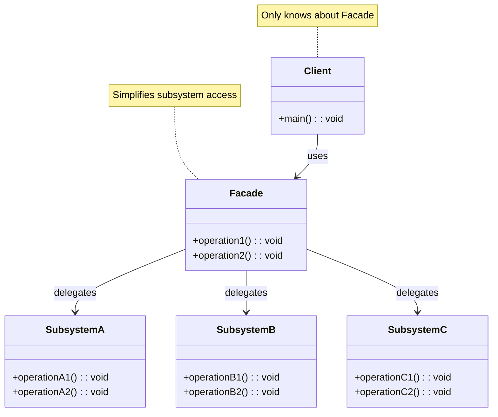
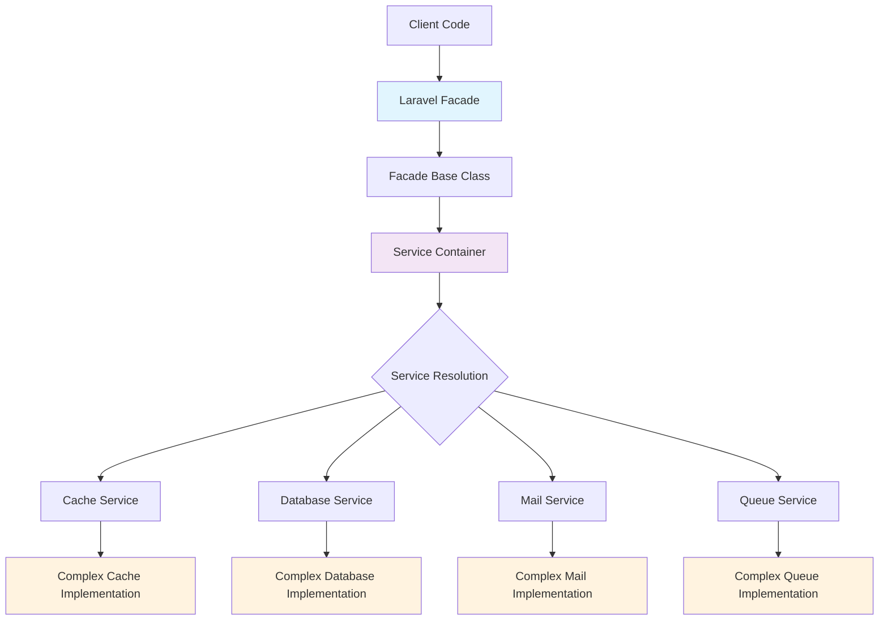
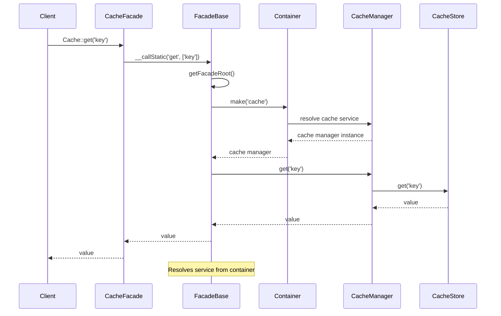

# Facade Pattern

## Overview

Provide a unified interface to a set of interfaces in a subsystem. Facade defines a higher-level interface that makes the subsystem easier to use.

## Architecture Diagram

### Facade Pattern Structure



### Laravel Facade System Architecture



### Facade Resolution Flow



## Design Intent

- **Simplify complex systems**: Hide subsystem complexity behind a simple interface
- **Reduce coupling**: Decouple clients from subsystem components
- **Improve usability**: Provide a convenient entry point to complex functionality
- **Promote layering**: Create clear boundaries between system layers

## Laravel Implementation

### 1. Laravel Facades

Laravel's Facade system is the most prominent implementation of the Facade pattern:

```php
// Illuminate\Support\Facades\Facade.php
abstract class Facade
{
    protected static $app;
    
    protected static $resolvedInstance = [];
    
    public static function getFacadeRoot()
    {
        return static::resolveFacadeInstance(static::getFacadeAccessor());
    }
    
    protected static function resolveFacadeInstance($name)
    {
        if (is_object($name)) {
            return $name;
        }
        
        if (isset(static::$resolvedInstance[$name])) {
            return static::$resolvedInstance[$name];
        }
        
        return static::$resolvedInstance[$name] = static::$app[$name];
    }
    
    public static function getFacadeAccessor()
    {
        throw new RuntimeException('Facade does not implement getFacadeAccessor method.');
    }
    
    public static function __callStatic($method, $args)
    {
        $instance = static::getFacadeRoot();
        
        if (! $instance) {
            throw new RuntimeException('A facade root has not been set.');
        }
        
        return $instance->$method(...$args);
    }
}
```

### 2. Database Facade Example

```php
// Illuminate\Support\Facades\DB.php
class DB extends Facade
{
    protected static function getFacadeAccessor()
    {
        return 'db';
    }
}

// Usage example
DB::table('users')->where('active', true)->get();
```

### 3. Cache Facade Implementation

```php
// Illuminate\Support\Facades\Cache.php
class Cache extends Facade
{
    protected static function getFacadeAccessor()
    {
        return 'cache';
    }
}

// Usage examples
Cache::put('key', 'value', $minutes);
Cache::get('key');
Cache::forget('key');
```

### 4. Request Facade

```php
// Illuminate\Support\Facades\Request.php
class Request extends Facade
{
    protected static function getFacadeAccessor()
    {
        return 'request';
    }
}

// Usage examples
Request::input('name');
Request::hasFile('photo');
Request::isMethod('post');
```

## Practical Application Scenarios

### 1. API Gateway Facade

```php
class ApiGatewayFacade
{
    protected $userService;
    protected $orderService;
    protected $paymentService;
    
    public function __construct()
    {
        $this->userService = app(UserService::class);
        $this->orderService = app(OrderService::class);
        $this->paymentService = app(PaymentService::class);
    }
    
    public function createOrder($userId, $orderData, $paymentData)
    {
        // Validate user
        $user = $this->userService->validateUser($userId);
        
        // Create order
        $order = $this->orderService->create($user, $orderData);
        
        // Process payment
        $payment = $this->paymentService->process($order, $paymentData);
        
        return [
            'order' => $order,
            'payment' => $payment
        ];
    }
}

// Client usage
$apiGateway = new ApiGatewayFacade();
$result = $apiGateway->createOrder(1, $orderData, $paymentData);
```

### 2. File Export Facade

```php
class ExportFacade
{
    protected $exporter;
    protected $formatter;
    protected $storage;
    
    public function __construct()
    {
        $this->exporter = app(DataExporter::class);
        $this->formatter = app(Formatter::class);
        $this->storage = app(StorageService::class);
    }
    
    public function exportData($data, $format, $filename)
    {
        // Extract data
        $exported = $this->exporter->extract($data);
        
        // Format data
        $formatted = $this->formatter->format($exported, $format);
        
        // Store file
        $filePath = $this->storage->store($formatted, $filename);
        
        return $filePath;
    }
}
```

### 3. Notification Facade

```php
class NotificationFacade
{
    protected $channels = [];
    
    public function __construct()
    {
        $this->channels = [
            'email' => app(EmailChannel::class),
            'sms' => app(SMSChannel::class),
            'slack' => app(SlackChannel::class),
        ];
    }
    
    public function notify($user, $message, $channels = ['email'])
    {
        $results = [];
        
        foreach ($channels as $channel) {
            if (isset($this->channels[$channel])) {
                $results[$channel] = $this->channels[$channel]->send($user, $message);
            }
        }
        
        return $results;
    }
}
```

## Source Code Analysis

### 1. Facade Pattern Characteristics in Laravel

Key characteristics of Laravel's facade implementation:

- **Static interface**: Provides static method access to underlying services
- **Service container integration**: Leverages Laravel's service container
- **Method forwarding**: Transparently forwards calls to underlying objects
- **Lazy loading**: Services are resolved only when needed

### 2. How Laravel Facades Work

```php
// Under the hood: service resolution
public static function getFacadeRoot()
{
    $name = static::getFacadeAccessor();
    
    if (isset(static::$resolvedInstance[$name])) {
        return static::$resolvedInstance[$name];
    }
    
    return static::$resolvedInstance[$name] = static::$app[$name];
}

// Magic method handling
public static function __callStatic($method, $args)
{
    $instance = static::getFacadeRoot();
    
    return $instance->$method(...$args);
}
```

### 3. Custom Facade Creation

```php
// 1. Create the service class
class ReportGenerator
{
    public function generate($data)
    {
        // Report generation logic
        return new Report($data);
    }
    
    public function export($report, $format)
    {
        // Export logic
        return $report->export($format);
    }
}

// 2. Register in service provider
$this->app->singleton('report', function ($app) {
    return new ReportGenerator();
});

// 3. Create facade
class Report extends Facade
{
    protected static function getFacadeAccessor()
    {
        return 'report';
    }
}

// 4. Usage
Report::generate($data);
Report::export($report, 'pdf');
```

## Best Practices

### 1. When to Use Facade Pattern

**Appropriate scenarios:**
- Complex subsystems that need simplified access
- Multiple related operations that can be grouped
- When you want to reduce coupling between layers
- For providing stable APIs over changing implementations

**Inappropriate scenarios:**
- Simple systems with few dependencies
- When direct access provides better performance
- When you need fine-grained control over subsystem components

### 2. Laravel Facade Best Practices

**Use dependency injection when:**
```php
// Good: Dependency injection for testability
class OrderController
{
    public function __construct(
        protected OrderService $orderService,
        protected PaymentService $paymentService
    ) {}
    
    public function store(CreateOrderRequest $request)
    {
        $order = $this->orderService->create($request->validated());
        return response()->json($order);
    }
}

// Use facades for quick access in views or simple cases
Route::get('/users', function () {
    return DB::table('users')->get(); // Quick facade usage
});
```

**Configuration-driven facades:**
```php
// config/app.php - Facade aliases
'aliases' => [
    'App' => Illuminate\Support\Facades\App::class,
    'Arr' => Illuminate\Support\Facades\Arr::class,
    'Auth' => Illuminate\Support\Facades\Auth::class,
    'Cache' => Illuminate\Support\Facades\Cache::class,
    // ... more facades
],
```

### 3. Testing with Facades

**Mocking facades in tests:**
```php
// In test class
public function test_cache_facade()
{
    Cache::shouldReceive('get')
        ->with('key')
        ->andReturn('cached_value');
    
    $result = Cache::get('key');
    
    $this->assertEquals('cached_value', $result);
}

// Testing custom facades
public function test_report_facade()
{
    Report::shouldReceive('generate')
        ->with(['data'])
        ->andReturn(new Report());
    
    $report = Report::generate(['data']);
    
    $this->assertInstanceOf(Report::class, $report);
}
```

## Performance Considerations

### 1. Facade Overhead

Laravel facades have minimal performance overhead:

```php
// The facade resolution process is optimized
// Only resolves the service once per request
if (isset(static::$resolvedInstance[$name])) {
    return static::$resolvedInstance[$name]; // Cached instance
}
```

### 2. Service Caching

Facades leverage Laravel's service container caching:

```php
// Services are cached in the resolved instances array
static::$resolvedInstance[$name] = static::$app[$name];
```

### 3. Real-time Performance

For performance-critical applications, consider direct service access:

```php
// Direct service access (slightly faster)
app('cache')->get('key');

// vs Facade access (more readable)
Cache::get('key');
```

## Summary

The Facade pattern is fundamental to Laravel's architecture. It provides a clean, simple interface to complex subsystems while maintaining the framework's elegance and developer experience. Laravel's implementation demonstrates how facades can significantly improve code readability and maintainability without sacrificing performance.

Facades embody the principle of "simplicity through abstraction" - they hide complexity while providing intuitive access to powerful functionality.