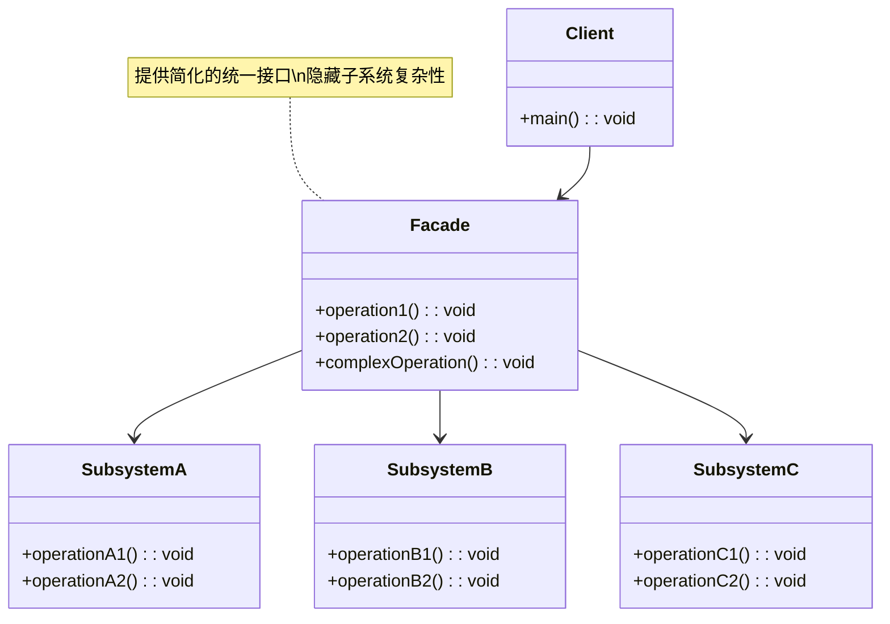
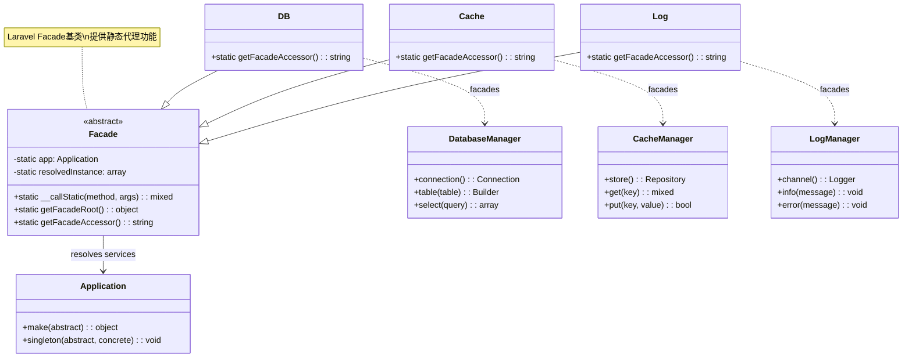
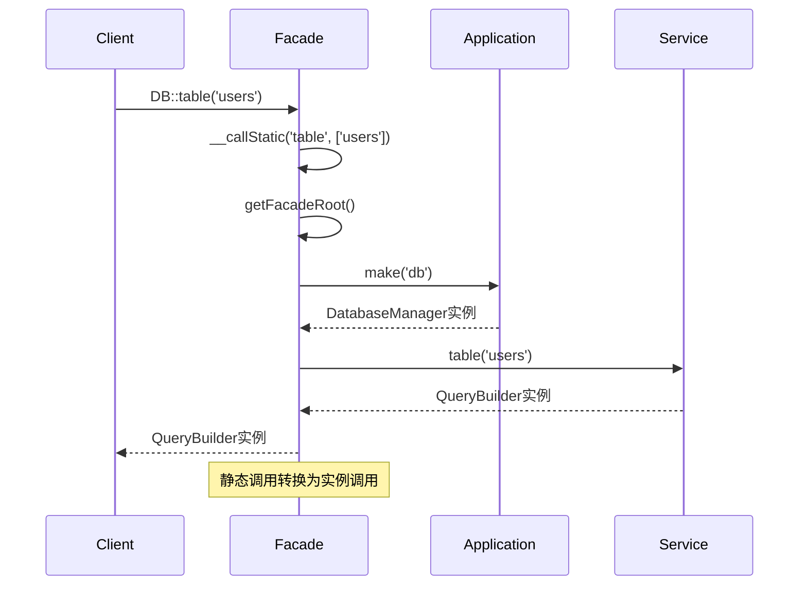
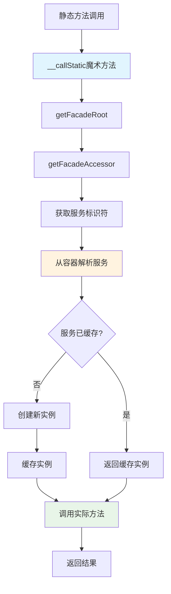
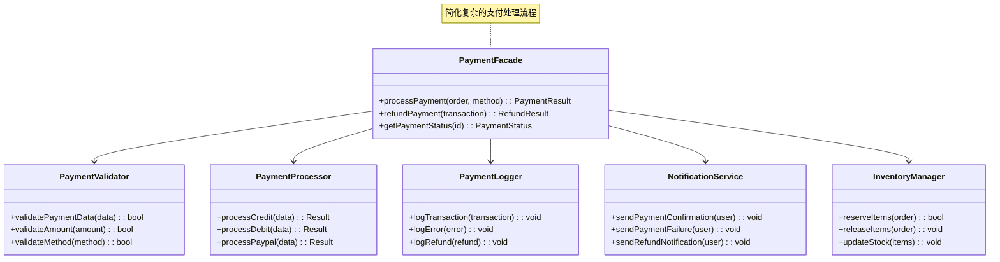
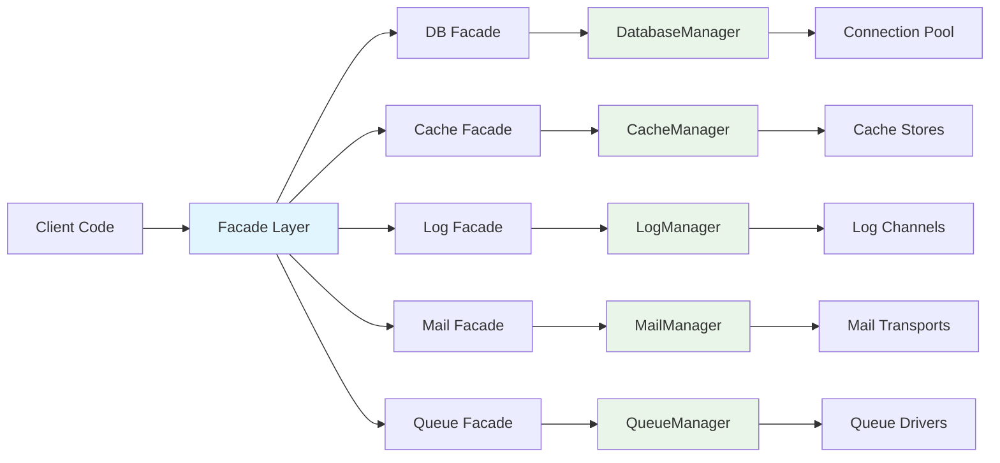

# 外观模式 (Facade Pattern)

## 概述

外观模式为子系统中的一组接口提供一个统一的界面。外观定义了一个更高层次的接口，使得子系统更容易使用。

## 架构图

### 外观模式类图


### Laravel Facade 系统架构


### Facade 调用时序图


### Laravel Facade 工作流程


### 复杂子系统外观示例


### Laravel 核心 Facades 架构


## 设计意图

- **简化复杂系统**：将子系统复杂性隐藏在简单接口后面
- **降低耦合度**：将客户端与子系统组件解耦
- **提高可用性**：为复杂功能提供便捷入口
- **促进分层**：在系统层之间创建清晰边界

## Laravel 中的实现

### 1. Laravel Facades

Laravel 的 Facade 系统是外观模式最突出的实现：

```php
// Illuminate\Support\Facades\Facade.php
abstract class Facade
{
    protected static $app;
    
    protected static $resolvedInstance = [];
    
    public static function getFacadeRoot()
    {
        return static::resolveFacadeInstance(static::getFacadeAccessor());
    }
    
    protected static function resolveFacadeInstance($name)
    {
        if (is_object($name)) {
            return $name;
        }
        
        if (isset(static::$resolvedInstance[$name])) {
            return static::$resolvedInstance[$name];
        }
        
        return static::$resolvedInstance[$name] = static::$app[$name];
    }
    
    public static function getFacadeAccessor()
    {
        throw new RuntimeException('Facade does not implement getFacadeAccessor method.');
    }
    
    public static function __callStatic($method, $args)
    {
        $instance = static::getFacadeRoot();
        
        if (! $instance) {
            throw new RuntimeException('A facade root has not been set.');
        }
        
        return $instance->$method(...$args);
    }
}
```

### 2. 数据库 Facade 示例

```php
// Illuminate\Support\Facades\DB.php
class DB extends Facade
{
    protected static function getFacadeAccessor()
    {
        return 'db';
    }
}

// 使用示例
DB::table('users')->where('active', true)->get();
```

### 3. 缓存 Facade 实现

```php
// Illuminate\Support\Facades\Cache.php
class Cache extends Facade
{
    protected static function getFacadeAccessor()
    {
        return 'cache';
    }
}

// 使用示例
Cache::put('key', 'value', $minutes);
Cache::get('key');
Cache::forget('key');
```

### 4. 请求 Facade

```php
// Illuminate\Support\Facades\Request.php
class Request extends Facade
{
    protected static function getFacadeAccessor()
    {
        return 'request';
    }
}

// 使用示例
Request::input('name');
Request::hasFile('photo');
Request::isMethod('post');
```

## 实际应用场景

### 1. API 网关外观

```php
class ApiGatewayFacade
{
    protected $userService;
    protected $orderService;
    protected $paymentService;
    
    public function __construct()
    {
        $this->userService = app(UserService::class);
        $this->orderService = app(OrderService::class);
        $this->paymentService = app(PaymentService::class);
    }
    
    public function createOrder($userId, $orderData, $paymentData)
    {
        // 验证用户
        $user = $this->userService->validateUser($userId);
        
        // 创建订单
        $order = $this->orderService->create($user, $orderData);
        
        // 处理支付
        $payment = $this->paymentService->process($order, $paymentData);
        
        return [
            'order' => $order,
            'payment' => $payment
        ];
    }
}

// 客户端使用
$apiGateway = new ApiGatewayFacade();
$result = $apiGateway->createOrder(1, $orderData, $paymentData);
```

### 2. 文件导出外观

```php
class ExportFacade
{
    protected $exporter;
    protected $formatter;
    protected $storage;
    
    public function __construct()
    {
        $this->exporter = app(DataExporter::class);
        $this->formatter = app(Formatter::class);
        $this->storage = app(StorageService::class);
    }
    
    public function exportData($data, $format, $filename)
    {
        // 提取数据
        $exported = $this->exporter->extract($data);
        
        // 格式化数据
        $formatted = $this->formatter->format($exported, $format);
        
        // 存储文件
        $filePath = $this->storage->store($formatted, $filename);
        
        return $filePath;
    }
}
```

### 3. 通知外观

```php
class NotificationFacade
{
    protected $channels = [];
    
    public function __construct()
    {
        $this->channels = [
            'email' => app(EmailChannel::class),
            'sms' => app(SMSChannel::class),
            'slack' => app(SlackChannel::class),
        ];
    }
    
    public function notify($user, $message, $channels = ['email'])
    {
        $results = [];
        
        foreach ($channels as $channel) {
            if (isset($this->channels[$channel])) {
                $results[$channel] = $this->channels[$channel]->send($user, $message);
            }
        }
        
        return $results;
    }
}
```

## 源码分析要点

### 1. Laravel 中外观模式的特征

Laravel Facade 实现的关键特征：

- **静态接口**：提供对底层服务的静态方法访问
- **服务容器集成**：利用 Laravel 的服务容器
- **方法转发**：透明地将调用转发到底层对象
- **延迟加载**：仅在需要时解析服务

### 2. Laravel Facades 工作原理

```php
// 底层：服务解析
public static function getFacadeRoot()
{
    $name = static::getFacadeAccessor();
    
    if (isset(static::$resolvedInstance[$name])) {
        return static::$resolvedInstance[$name];
    }
    
    return static::$resolvedInstance[$name] = static::$app[$name];
}

// 魔术方法处理
public static function __callStatic($method, $args)
{
    $instance = static::getFacadeRoot();
    
    return $instance->$method(...$args);
}
```

### 3. 自定义 Facade 创建

```php
// 1. 创建服务类
class ReportGenerator
{
    public function generate($data)
    {
        // 报告生成逻辑
        return new Report($data);
    }
    
    public function export($report, $format)
    {
        // 导出逻辑
        return $report->export($format);
    }
}

// 2. 在服务提供者中注册
$this->app->singleton('report', function ($app) {
    return new ReportGenerator();
});

// 3. 创建 Facade
class Report extends Facade
{
    protected static function getFacadeAccessor()
    {
        return 'report';
    }
}

// 4. 使用
Report::generate($data);
Report::export($report, 'pdf');
```

## 最佳实践

### 1. 何时使用外观模式

**适用场景：**
- 需要简化访问的复杂子系统
- 可以分组的多项相关操作
- 想要减少层间耦合度时
- 为变化的实现提供稳定 API

**不适用场景：**
- 依赖关系少的简单系统
- 直接访问能提供更好性能时
- 需要对子系统组件进行细粒度控制时

### 2. Laravel Facade 最佳实践

**使用依赖注入的情况：**
```php
// 良好：依赖注入提高可测试性
class OrderController
{
    public function __construct(
        protected OrderService $orderService,
        protected PaymentService $paymentService
    ) {}
    
    public function store(CreateOrderRequest $request)
    {
        $order = $this->orderService->create($request->validated());
        return response()->json($order);
    }
}

// 在视图或简单情况下使用 Facade 快速访问
Route::get('/users', function () {
    return DB::table('users')->get(); // 快速 Facade 使用
});
```

**配置驱动的 Facades：**
```php
// config/app.php - Facade 别名
'aliases' => [
    'App' => Illuminate\Support\Facades\App::class,
    'Arr' => Illuminate\Support\Facades\Arr::class,
    'Auth' => Illuminate\Support\Facades\Auth::class,
    'Cache' => Illuminate\Support\Facades\Cache::class,
    // ... 更多 Facades
],
```

### 3. 使用 Facades 进行测试

**在测试中模拟 Facades：**
```php
// 在测试类中
public function test_cache_facade()
{
    Cache::shouldReceive('get')
        ->with('key')
        ->andReturn('cached_value');
    
    $result = Cache::get('key');
    
    $this->assertEquals('cached_value', $result);
}

// 测试自定义 Facades
public function test_report_facade()
{
    Report::shouldReceive('generate')
        ->with(['data'])
        ->andReturn(new Report());
    
    $report = Report::generate(['data']);
    
    $this->assertInstanceOf(Report::class, $report);
}
```

## 性能考虑

### 1. Facade 开销

Laravel Facades 的性能开销很小：

```php
// Facade 解析过程经过优化
// 每个请求只解析一次服务
if (isset(static::$resolvedInstance[$name])) {
    return static::$resolvedInstance[$name]; // 缓存实例
}
```

### 2. 服务缓存

Facades 利用 Laravel 的服务容器缓存：

```php
// 服务缓存在已解析实例数组中
static::$resolvedInstance[$name] = static::$app[$name];
```

### 3. 实时性能

对于性能关键的应用，考虑直接服务访问：

```php
// 直接服务访问（稍快）
app('cache')->get('key');

// vs Facade 访问（更可读）
Cache::get('key');
```

## 总结

外观模式是 Laravel 架构的基础。它为复杂的子系统提供了干净、简单的接口，同时保持了框架的优雅和开发人员体验。Laravel 的实现展示了外观模式如何在不牺牲性能的情况下显著提高代码的可读性和可维护性。

外观模式体现了"通过抽象实现简单性"的原则 - 它们在隐藏复杂性的同时，提供了对强大功能的直观访问。