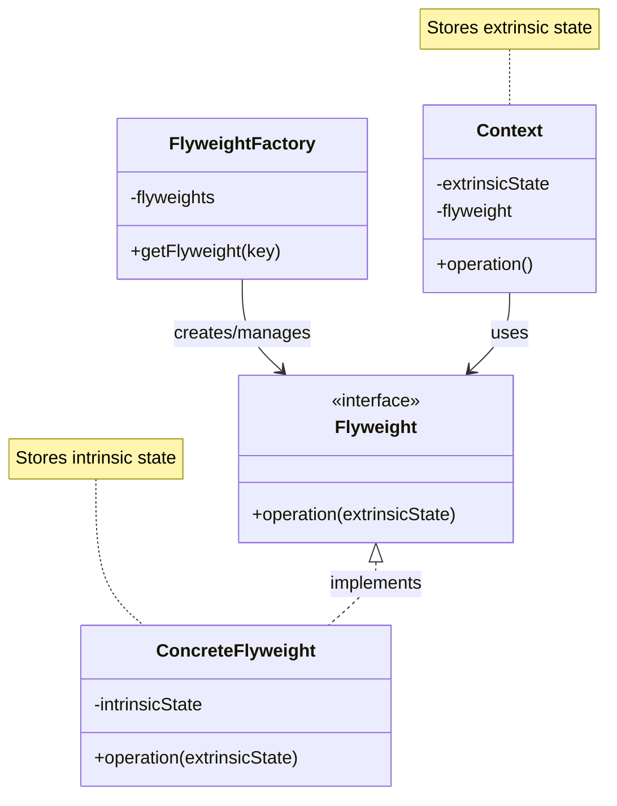
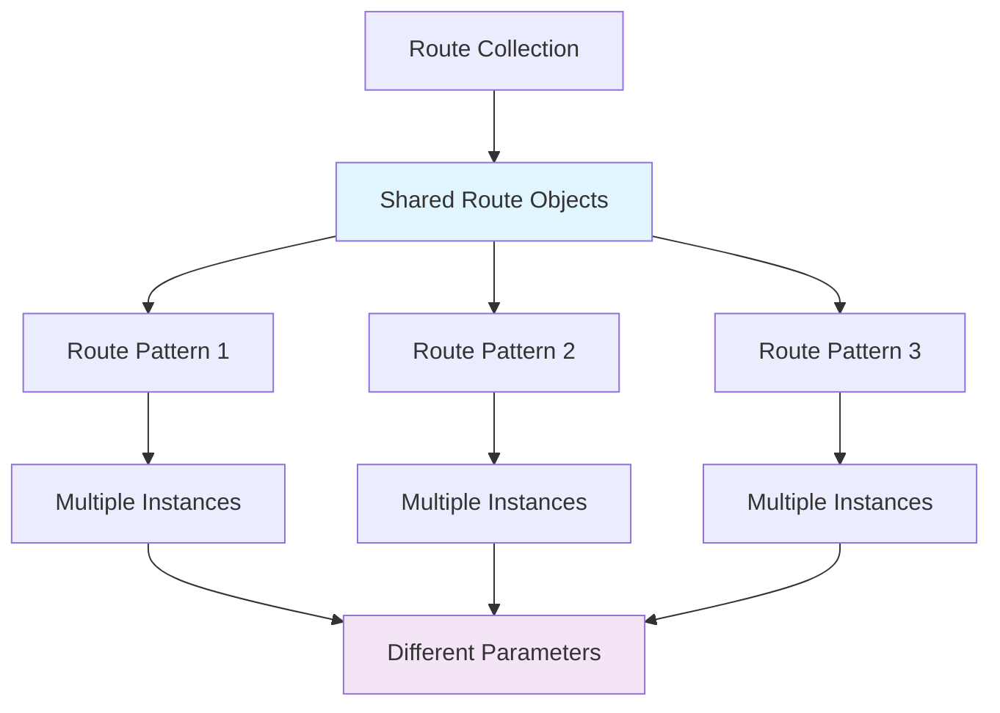

# Flyweight Pattern

## Overview

Use sharing to support large numbers of fine-grained objects efficiently. The Flyweight pattern minimizes memory usage by sharing efficiently among similar objects.

## Architecture Diagram

### Flyweight Pattern Structure



### Laravel Route Flyweight



## Implementation in Laravel

### 1. Route Sharing

Laravel shares route patterns to reduce memory usage:

```php
// Illuminate\Routing\RouteCollection.php
class RouteCollection implements Countable, IteratorAggregate
{
    protected $routes = [];
    protected $allRoutes = [];
    protected $nameList = [];
    protected $actionList = [];
    
    public function add(Route $route)
    {
        $this->addToCollections($route);
        $this->addLookups($route);
        
        return $route;
    }
    
    protected function addToCollections($route)
    {
        $domainAndUri = $route->getDomain().$route->uri();
        
        foreach ($route->methods() as $method) {
            $this->routes[$method][$domainAndUri] = $route;
        }
        
        $this->allRoutes[$method.$domainAndUri] = $route;
    }
}
```

### 2. Validation Rule Flyweights

```php
// Shared validation rule instances
class ValidationRuleFactory
{
    protected static $instances = [];
    
    public static function make($rule)
    {
        if (!isset(static::$instances[$rule])) {
            static::$instances[$rule] = static::createRule($rule);
        }
        
        return static::$instances[$rule];
    }
    
    protected static function createRule($rule)
    {
        switch ($rule) {
            case 'required':
                return new RequiredRule();
            case 'email':
                return new EmailRule();
            case 'numeric':
                return new NumericRule();
            default:
                throw new InvalidArgumentException("Unknown rule: {$rule}");
        }
    }
}
```