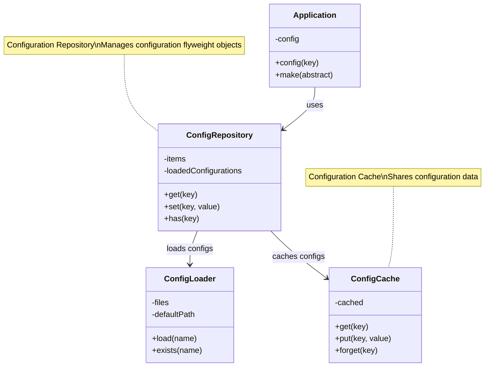
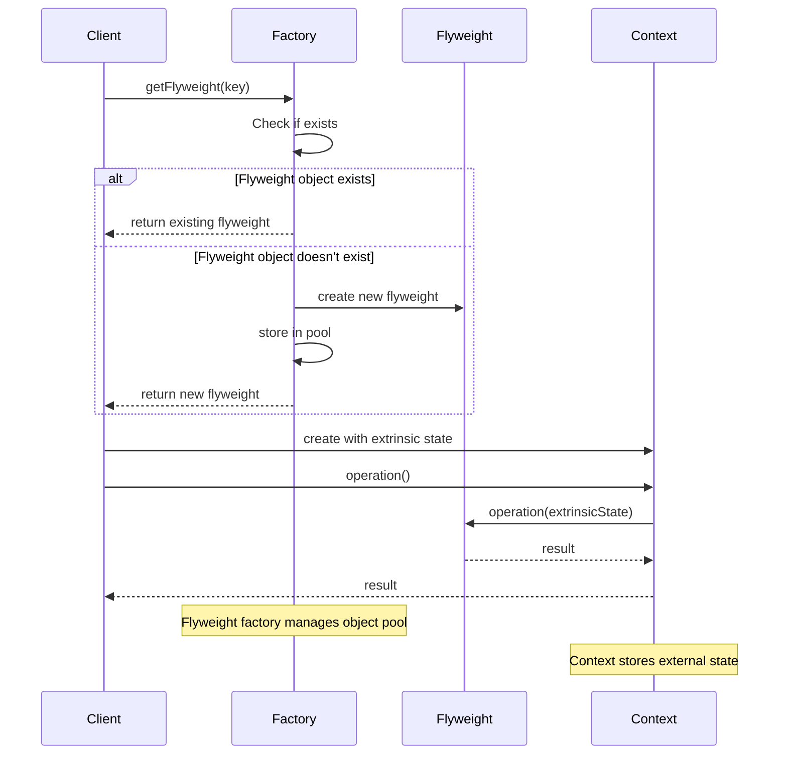

# Flyweight Pattern

## Overview

The Flyweight pattern uses sharing to support large numbers of fine-grained objects efficiently. It minimizes memory usage by sharing efficiently among similar objects, avoiding the overhead of creating large numbers of similar classes, thereby improving system resource utilization.

## Architecture Diagram

### Laravel Configuration Flyweight Architecture


### Flyweight Pattern Sequence Diagram


## Design Intent

- **Object Reuse**: Share similar objects to reduce memory usage
- **Performance Optimization**: Avoid the overhead of creating large numbers of similar objects
- **Memory Saving**: Save memory by sharing internal state
- **External State**: Externalize variable state to maintain object immutability

## Implementation in Laravel

### 1. Configuration Object Flyweight

Laravel's configuration system uses the Flyweight pattern to share configuration objects:

```php
// Illuminate\Config\Repository.php
class Repository
{
    protected $items = [];
    protected $loadedConfigurations = [];
    
    public function __construct(array $items = [])
    {
        $this->items = $items;
    }
    
    // Flyweight pattern: Share configuration objects
    public function get($key, $default = null)
    {
        // Check if configuration has been loaded
        if (isset($this->loadedConfigurations[$key])) {
            return $this->loadedConfigurations[$key];
        }
        
        // If configuration doesn't exist, try to load
        if (! $this->has($key)) {
            $value = $this->loadConfiguration($key, $default);
            
            if ($value !== null) {
                // Cache configuration object for reuse
                $this->loadedConfigurations[$key] = $value;
                return $value;
            }
        }
        
        return Arr::get($this->items, $key, $default);
    }
    
    protected function loadConfiguration($key, $default = null)
    {
        // Load configuration from file system
        $segments = explode('.', $key);
        $file = array_shift($segments);
        
        if ($this->configLoader->exists($file)) {
            $configuration = $this->configLoader->load($this->environment, $file);
            
            // Cache entire configuration file
            $this->items[$file] = $configuration;
            $this->loadedConfigurations[$file] = $configuration;
            
            return Arr::get($configuration, implode('.', $segments), $default);
        }
        
        return $default;
    }
    
    // Share configuration object
    public function share($key, $value)
    {
        $this->loadedConfigurations[$key] = $value;
        return $this;
    }
}
```

### 2. Database Connection Flyweight

Laravel's database connection manager uses the Flyweight pattern to share connections:

```php
// Illuminate\Database\DatabaseManager.php
class DatabaseManager implements ConnectionResolverInterface
{
    protected $app;
    protected $connections = [];
    protected $extensions = [];
    
    public function __construct($app)
    {
        $this->app = $app;
    }
    
    // Flyweight pattern: Share database connections
    public function connection($name = null)
    {
        $name = $name ?: $this->getDefaultConnection();
        
        // If connection already exists, return shared connection object
        if (isset($this->connections[$name])) {
            return $this->connections[$name];
        }
        
        // Create new connection and cache for reuse
        return $this->connections[$name] = $this->makeConnection($name);
    }
    
    protected function makeConnection($name)
    {
        $config = $this->configuration($name);
        
        // Reuse connection configuration (internal state)
        $connection = $this->createConnector($config)->connect($config);
        
        // Create connection object, share configuration information
        $connection = $this->configure($connection, $config);
        
        return $connection;
    }
    
    // Share connection configuration
    public function addConnection(array $config, $name = 'default')
    {
        $this->configurations[$name] = $config;
        
        // If connection exists, reconfigure
        if (isset($this->connections[$name])) {
            $this->connections[$name] = $this->configure(
                $this->connections[$name], $config
            );
        }
    }
}
```

## Practical Application Scenarios

### 1. Character Formatting Flyweight

Implement Flyweight pattern for character formatting objects:

```php
// Character formatting flyweight factory
class CharacterFormatterFactory
{
    private $formatters = [];
    
    public function getFormatter($fontFamily, $fontSize, $color)
    {
        $key = $this->getKey($fontFamily, $fontSize, $color);
        
        if (!isset($this->formatters[$key])) {
            $this->formatters[$key] = new CharacterFormatter($fontFamily, $fontSize, $color);
        }
        
        return $this->formatters[$key];
    }
    
    private function getKey($fontFamily, $fontSize, $color)
    {
        return md5("{$fontFamily}-{$fontSize}-{$color}");
    }
    
    public function getFormatterCount()
    {
        return count($this->formatters);
    }
}

// Character formatting flyweight (internal state)
class CharacterFormatter
{
    private $fontFamily;
    private $fontSize;
    private $color;
    
    public function __construct($fontFamily, $fontSize, $color)
    {
        $this->fontFamily = $fontFamily;
        $this->fontSize = $fontSize;
        $this->color = $color;
    }
    
    public function format($character, $position)
    {
        // Format character, position is external state
        return sprintf(
            '<span style="font-family: %s; font-size: %dpx; color: %s; position: absolute; left: %dpx; top: %dpx;">%s</span>',
            $this->fontFamily,
            $this->fontSize,
            $this->color,
            $position['x'],
            $position['y'],
            htmlspecialchars($character)
        );
    }
    
    public function getFontInfo()
    {
        return [
            'family' => $this->fontFamily,
            'size' => $this->fontSize,
            'color' => $this->color
        ];
    }
}

// Character object (contains external state)
class Character
{
    private $character;
    private $formatter;
    private $position;
    
    public function __construct($character, CharacterFormatter $formatter, $position)
    {
        $this->character = $character;
        $this->formatter = $formatter;
        $this->position = $position;
    }
    
    public function render()
    {
        return $this->formatter->format($this->character, $this->position);
    }
    
    public function getCharacter()
    {
        return $this->character;
    }
}

// Text editor using Flyweight pattern
class TextEditor
{
    private $factory;
    private $characters = [];
    
    public function __construct(CharacterFormatterFactory $factory)
    {
        $this->factory = $factory;
    }
    
    public function addCharacter($char, $fontFamily, $fontSize, $color, $x, $y)
    {
        $formatter = $this->factory->getFormatter($fontFamily, $fontSize, $color);
        $this->characters[] = new Character($char, $formatter, ['x' => $x, 'y' => $y]);
    }
    
    public function render()
    {
        $output = '';
        foreach ($this->characters as $character) {
            $output .= $character->render();
        }
        return $output;
    }
    
    public function getFormatterCount()
    {
        return $this->factory->getFormatterCount();
    }
}
```

### 2. Icon Flyweight System

Implement Flyweight pattern for icon objects:

```php
// Icon flyweight factory
class IconFactory
{
    private $icons = [];
    private $iconCache = [];
    
    public function getIcon($name, $size = 'sm')
    {
        $key = "{$name}-{$size}";
        
        if (!isset($this->icons[$key])) {
            // Load icon from cache or file system
            $iconData = $this->loadIconData($name, $size);
            $this->icons[$key] = new Icon($name, $size, $iconData);
        }
        
        return $this->icons[$key];
    }
    
    private function loadIconData($name, $size)
    {
        $cacheKey = "{$name}-{$size}";
        
        if (isset($this->iconCache[$cacheKey])) {
            return $this->iconCache[$cacheKey];
        }
        
        // Load icon data from file system
        $path = resource_path("icons/{$size}/{$name}.svg");
        
        if (file_exists($path)) {
            $data = file_get_contents($path);
            $this->iconCache[$cacheKey] = $data;
            return $data;
        }
        
        // Return default icon
        return $this->getDefaultIcon($size);
    }
    
    public function preloadIcons(array $icons, $size = 'sm')
    {
        foreach ($icons as $icon) {
            $this->getIcon($icon, $size);
        }
    }
    
    public function getLoadedIconCount()
    {
        return count($this->icons);
    }
}

// Icon flyweight (internal state)
class Icon
{
    private $name;
    private $size;
    private $data;
    
    public function __construct($name, $size, $data)
    {
        $this->name = $name;
        $this->size = $size;
        $this->data = $data;
    }
    
    public function render($color = '#000000', $classes = '')
    {
        // Replace color and classes (external state)
        $rendered = str_replace('currentColor', $color, $this->data);
        
        if ($classes) {
            $rendered = str_replace('<svg', "<svg class=\"{$classes}\"", $rendered);
        }
        
        return $rendered;
    }
    
    public function getInfo()
    {
        return [
            'name' => $this->name,
            'size' => $this->size,
            'data_length' => strlen($this->data)
        ];
    }
}

// Icon button (contains external state)
class IconButton
{
    private $icon;
    private $color;
    private $classes;
    private $text;
    private $onClick;
    
    public function __construct(Icon $icon, $text = '', $color = '#000000', $classes = '', $onClick = '')
    {
        $this->icon = $icon;
        $this->text = $text;
        $this->color = $color;
        $this->classes = $classes;
        $this->onClick = $onClick;
    }
    
    public function render()
    {
        $iconHtml = $this->icon->render($this->color, $this->classes);
        $textHtml = $this->text ? "<span>{$this->text}</span>" : '';
        $onClickAttr = $this->onClick ? "onclick=\"{$this->onClick}\"" : '';
        
        return "<button {$onClickAttr} class=\"icon-button\">{$iconHtml}{$textHtml}</button>";
    }
}
```

## Source Code Analysis Points

### 1. Core Structure of Flyweight Pattern

```php
// Flyweight factory
class FlyweightFactory
{
    private $flyweights = [];
    
    public function getFlyweight($key)
    {
        if (!isset($this->flyweights[$key])) {
            $this->flyweights[$key] = new ConcreteFlyweight($key);
        }
        
        return $this->flyweights[$key];
    }
    
    public function getFlyweightCount()
    {
        return count($this->flyweights);
    }
}

// Concrete flyweight
class ConcreteFlyweight
{
    private $intrinsicState;
    
    public function __construct($intrinsicState)
    {
        $this->intrinsicState = $intrinsicState;
    }
    
    public function operation($extrinsicState)
    {
        return "Intrinsic: {$this->intrinsicState}, Extrinsic: {$extrinsicState}";
    }
}

// Client usage
class Client
{
    private $factory;
    
    public function __construct(FlyweightFactory $factory)
    {
        $this->factory = $factory;
    }
    
    public function doOperation()
    {
        $flyweight = $this->factory->getFlyweight('shared-state');
        return $flyweight->operation('external-state');
    }
}
```

### 2. Flyweight Application in Laravel

Laravel's service container singleton binding uses Flyweight pattern concepts:

```php
// Illuminate\Container\Container.php
class Container implements ContainerInterface
{
    protected $instances = [];
    protected $bindings = [];
    
    // Flyweight pattern: Share service instances
    public function singleton($abstract, $concrete = null)
    {
        $this->bind($abstract, $concrete, true);
    }
    
    public function instance($abstract, $instance)
    {
        // Directly share instance
        $this->instances[$abstract] = $instance;
        
        if ($this->bound($abstract)) {
            unset($this->bindings[$abstract]);
        }
    }
    
    public function make($abstract, array $parameters = [])
    {
        // If instance already exists, return shared instance
        if (isset($this->instances[$abstract])) {
            return $this->instances[$abstract];
        }
        
        // Create new instance and cache
        $object = $this->resolve($abstract, $parameters);
        
        if ($this->isShared($abstract)) {
            $this->instances[$abstract] = $object;
        }
        
        return $object;
    }
}
```

## Best Practices

### 1. Appropriate Use of Flyweight Pattern

**Suitable Scenarios:**
- When system has large numbers of similar objects
- When most object state can be externalized
- When Flyweight pattern can significantly save memory
- When object creation cost is high

**Unsuitable Scenarios:**
- When objects differ greatly
- When external state management is too complex
- When performance requirements are not high

### 2. Flyweight Practice in Laravel

**Cache Flyweight Objects:**
```php
class CacheFlyweight
{
    private $cache;
    private $factory;
    
    public function __construct(Cache $cache, FlyweightFactory $factory)
    {
        $this->cache = $cache;
        $this->factory = $factory;
    }
    
    public function get($key, $default = null)
    {
        // First try to get from cache
        if ($this->cache->has($key)) {
            return $this->cache->get($key);
        }
        
        // Get from factory and cache
        $value = $this->factory->create($key) ?? $default;
        $this->cache->put($key, $value, 3600);
        
        return $value;
    }
}
```

**Database Connection Flyweight:**
```php
class ConnectionPool
{
    private $connections = [];
    private $maxConnections;
    
    public function __construct($maxConnections = 10)
    {
        $this->maxConnections = $maxConnections;
    }
    
    public function getConnection($config)
    {
        $key = md5(serialize($config));
        
        if (!isset($this->connections[$key]) || count($this->connections) < $this->maxConnections) {
            $this->connections[$key] = $this->createConnection($config);
        }
        
        return $this->connections[$key];
    }
}
```

## Relationship with Other Patterns

### 1. With Singleton Pattern

Flyweight pattern focuses on object sharing, Singleton pattern focuses on unique instance:

```php
// Flyweight pattern: Multiple shared objects
class FlyweightFactory 
{
    private $flyweights = [];
    
    public function getFlyweight($key) 
    {
        if (!isset($this->flyweights[$key])) {
            $this->flyweights[$key] = new Flyweight($key);
        }
        return $this->flyweights[$key];
    }
}

// Singleton pattern: Unique instance
class Singleton 
{
    private static $instance;
    
    public static function getInstance() 
    {
        if (!self::$instance) {
            self::$instance = new self();
        }
        return self::$instance;
    }
}
```

### 2. With Object Pool Pattern

Flyweight pattern shares immutable objects, Object Pool pattern shares reusable objects:

```php
// Flyweight pattern: Share immutable objects
class CharacterFlyweight 
{
    private $character;
    
    public function __construct($char) 
    {
        $this->character = $char;
    }
    
    public function display($position) 
    {
        return "{$this->character} at ({$position['x']}, {$position['y']})";
    }
}

// Object Pool pattern: Share reusable objects
class DatabaseConnectionPool 
{
    private $connections = [];
    
    public function getConnection() 
    {
        if (empty($this->connections)) {
            return $this->createConnection();
        }
        return array_pop($this->connections);
    }
    
    public function releaseConnection($connection) 
    {
        $this->connections[] = $connection;
    }
}
```

## Performance Considerations

### 1. Memory Optimization

The main purpose of Flyweight pattern is to optimize memory usage:

```php
// Memory-sensitive flyweight implementation
class MemorySensitiveFlyweight
{
    private $sharedData;
    private static $instances = [];
    
    private function __construct($data)
    {
        $this->sharedData = $data;
    }
    
    public static function getInstance($key)
    {
        if (!isset(self::$instances[$key])) {
            self::$instances[$key] = new self($key);
        }
        return self::$instances[$key];
    }
    
    public function __destruct()
    {
        // Clean up unused flyweight objects
        if (count(self::$instances) > 1000) {
            self::$instances = array_slice(self::$instances, -500, 500, true);
        }
    }
}
```

### 2. Cache Strategy

Reasonable cache strategy is crucial for Flyweight pattern performance:

```php
class SmartFlyweightFactory
{
    private $cache;
    private $hits = 0;
    private $misses = 0;
    
    public function get($key)
    {
        if ($this->cache->has($key)) {
            $this->hits++;
            return $this->cache->get($key);
        }
        
        $this->misses++;
        $value = $this->create($key);
        $this->cache->set($key, $value);
        
        return $value;
    }
    
    public function getHitRate()
    {
        $total = $this->hits + $this->misses;
        return $total > 0 ? $this->hits / $total : 0;
    }
}
```

## Summary

The Flyweight pattern is an important design pattern in Laravel framework for optimizing resource usage. It reduces memory usage and improves performance by sharing similar objects. This pattern is reflected in multiple core components including configuration management, database connections, and view components.

Advantages of Flyweight pattern:
- **Memory Optimization**: Significantly reduces memory usage of similar objects
- **Performance Improvement**: Avoids overhead of repeated object creation
- **Resource Reuse**: Efficiently shares immutable objects
- **Scalability**: Easy to add new flyweight types

In Laravel development, proper use of Flyweight pattern can create high-performance, low-memory systems, especially when dealing with large numbers of similar objects.
