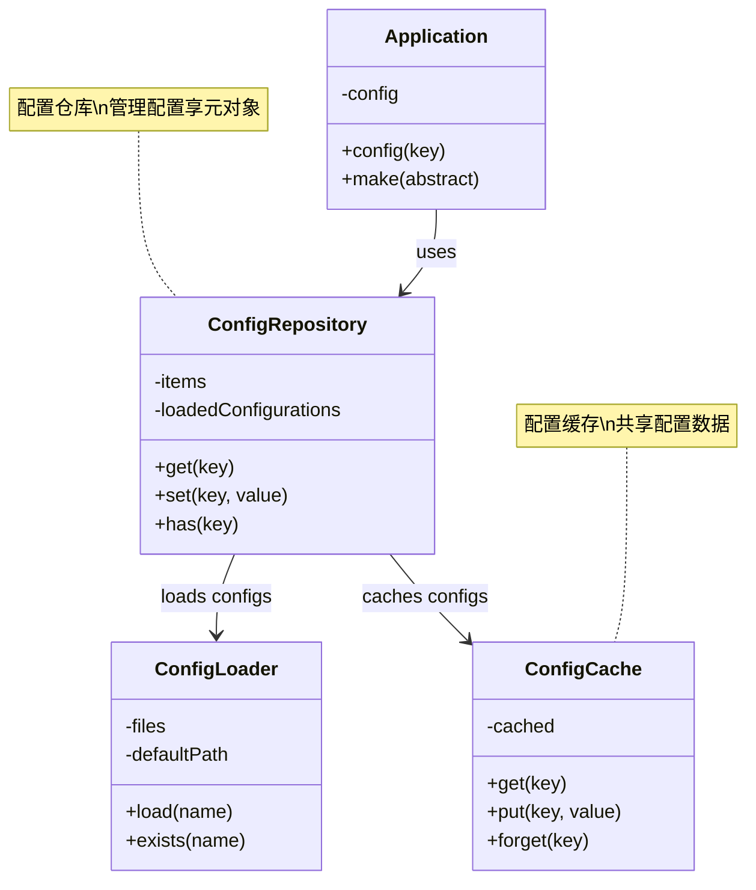
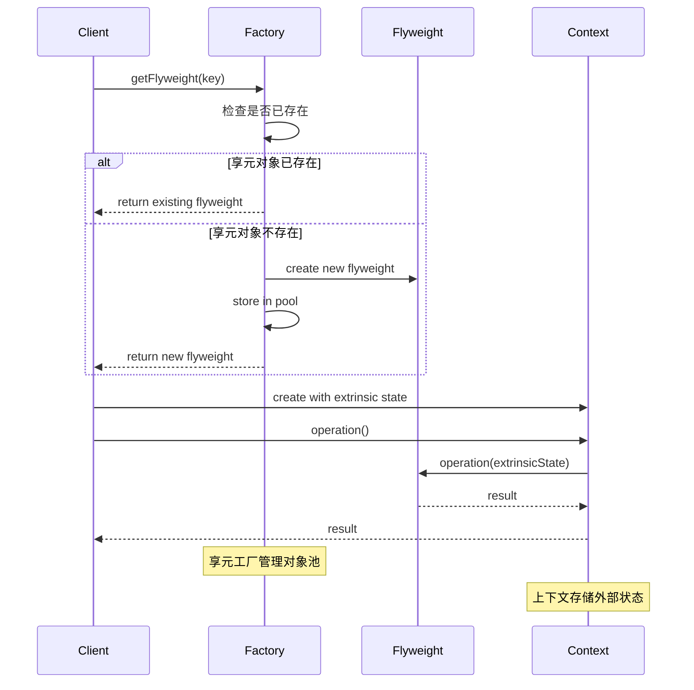

# 享元模式 (Flyweight Pattern)

## 概述

享元模式运用共享技术有效地支持大量细粒度对象的复用。它通过共享已经存在的对象来大幅度减少需要创建的对象数量，避免大量相似类的开销，从而提高系统资源的利用率。

## 架构图

### Laravel 配置享元架构


### 享元模式时序图



## 设计意图

- **对象复用**：共享相似对象，减少内存占用
- **性能优化**：避免大量相似对象的创建开销
- **内存节约**：通过共享内部状态来节约内存
- **外部状态**：将可变状态外部化，保持对象不变性

## Laravel 中的实现

### 1. 配置对象享元

Laravel 的配置系统使用了享元模式来共享配置对象：

```php
// Illuminate\Config\Repository.php
class Repository
{
    protected $items = [];
    protected $loadedConfigurations = [];
    
    public function __construct(array $items = [])
    {
        $this->items = $items;
    }
    
    // 享元模式：共享配置对象
    public function get($key, $default = null)
    {
        // 检查是否已经加载过该配置
        if (isset($this->loadedConfigurations[$key])) {
            return $this->loadedConfigurations[$key];
        }
        
        // 如果配置不存在，尝试加载
        if (! $this->has($key)) {
            $value = $this->loadConfiguration($key, $default);
            
            if ($value !== null) {
                // 缓存配置对象以供复用
                $this->loadedConfigurations[$key] = $value;
                return $value;
            }
        }
        
        return Arr::get($this->items, $key, $default);
    }
    
    protected function loadConfiguration($key, $default = null)
    {
        // 从文件系统加载配置
        $segments = explode('.', $key);
        $file = array_shift($segments);
        
        if ($this->configLoader->exists($file)) {
            $configuration = $this->configLoader->load($this->environment, $file);
            
            // 缓存整个配置文件
            $this->items[$file] = $configuration;
            $this->loadedConfigurations[$file] = $configuration;
            
            return Arr::get($configuration, implode('.', $segments), $default);
        }
        
        return $default;
    }
    
    // 共享配置对象
    public function share($key, $value)
    {
        $this->loadedConfigurations[$key] = $value;
        return $this;
    }
}
```

### 2. 数据库连接享元

Laravel 的数据库连接管理器使用享元模式共享连接：

```php
// Illuminate\Database\DatabaseManager.php
class DatabaseManager implements ConnectionResolverInterface
{
    protected $app;
    protected $connections = [];
    protected $extensions = [];
    
    public function __construct($app)
    {
        $this->app = $app;
    }
    
    // 享元模式：共享数据库连接
    public function connection($name = null)
    {
        $name = $name ?: $this->getDefaultConnection();
        
        // 如果连接已经存在，直接返回共享的连接对象
        if (isset($this->connections[$name])) {
            return $this->connections[$name];
        }
        
        // 创建新的连接并缓存以供复用
        return $this->connections[$name] = $this->makeConnection($name);
    }
    
    protected function makeConnection($name)
    {
        $config = $this->configuration($name);
        
        // 重用连接配置（内部状态）
        $connection = $this->createConnector($config)->connect($config);
        
        // 创建连接对象，共享配置信息
        $connection = $this->configure($connection, $config);
        
        return $connection;
    }
    
    // 共享连接配置
    public function addConnection(array $config, $name = 'default')
    {
        $this->configurations[$name] = $config;
        
        // 如果连接已存在，重新配置
        if (isset($this->connections[$name])) {
            $this->connections[$name] = $this->configure(
                $this->connections[$name], $config
            );
        }
    }
}
```

### 3. 视图组件享元

Laravel 的视图系统使用享元模式共享视图组件：

```php
// Illuminate\View\Factory.php
class Factory implements FactoryContract
{
    protected $engines;
    protected $shared = [];
    protected $renderCount = 0;
    
    public function __construct($engines, $finder, $events, $container = null)
    {
        $this->engines = $engines;
        $this->finder = $finder;
        $this->events = $events;
        $this->container = $container ?: new Container;
        
        // 共享数据（享元内部状态）
        $this->share('__env', $this);
        $this->share('app', $this->container->make('app'));
    }
    
    // 享元模式：共享视图数据
    public function share($key, $value = null)
    {
        $keys = is_array($key) ? $key : [$key => $value];
        
        foreach ($keys as $key => $value) {
            $this->shared[$key] = $value;
        }
        
        return $this;
    }
    
    public function make($view, $data = [], $mergeData = [])
    {
        $path = $this->finder->find($view);
        
        // 重用视图引擎（享元对象）
        $engine = $this->getEngineFromPath($path);
        
        // 合并共享数据
        $data = array_merge($this->shared, $data);
        
        return new View($this, $engine, $view, $path, $data);
    }
    
    // 获取共享的视图引擎
    protected function getEngineFromPath($path)
    {
        if (! $extension = $this->getExtension($path)) {
            throw new InvalidArgumentException("Unrecognized extension in file: {$path}");
        }
        
        $engine = $this->extensions[$extension];
        
        // 如果引擎已经实例化，直接返回共享实例
        if (isset($this->engines[$engine])) {
            return $this->engines[$engine];
        }
        
        // 创建新的引擎实例并缓存
        return $this->engines[$engine] = $this->resolveEngine($engine);
    }
}
```

## 实际应用场景

### 1. 字符格式化享元

实现字符格式化对象的享元模式：

```php
// 字符格式化享元工厂
class CharacterFormatterFactory
{
    private $formatters = [];
    
    public function getFormatter($fontFamily, $fontSize, $color)
    {
        $key = $this->getKey($fontFamily, $fontSize, $color);
        
        if (!isset($this->formatters[$key])) {
            $this->formatters[$key] = new CharacterFormatter($fontFamily, $fontSize, $color);
        }
        
        return $this->formatters[$key];
    }
    
    private function getKey($fontFamily, $fontSize, $color)
    {
        return md5("{$fontFamily}-{$fontSize}-{$color}");
    }
    
    public function getFormatterCount()
    {
        return count($this->formatters);
    }
}

// 字符格式化享元（内部状态）
class CharacterFormatter
{
    private $fontFamily;
    private $fontSize;
    private $color;
    
    public function __construct($fontFamily, $fontSize, $color)
    {
        $this->fontFamily = $fontFamily;
        $this->fontSize = $fontSize;
        $this->color = $color;
    }
    
    public function format($character, $position)
    {
        // 格式化字符，position 是外部状态
        return sprintf(
            '<span style="font-family: %s; font-size: %dpx; color: %s; position: absolute; left: %dpx; top: %dpx;">%s</span>',
            $this->fontFamily,
            $this->fontSize,
            $this->color,
            $position['x'],
            $position['y'],
            htmlspecialchars($character)
        );
    }
    
    public function getFontInfo()
    {
        return [
            'family' => $this->fontFamily,
            'size' => $this->fontSize,
            'color' => $this->color
        ];
    }
}

// 字符对象（包含外部状态）
class Character
{
    private $character;
    private $formatter;
    private $position;
    
    public function __construct($character, CharacterFormatter $formatter, $position)
    {
        $this->character = $character;
        $this->formatter = $formatter;
        $this->position = $position;
    }
    
    public function render()
    {
        return $this->formatter->format($this->character, $this->position);
    }
    
    public function getCharacter()
    {
        return $this->character;
    }
}

// 文本编辑器使用享元模式
class TextEditor
{
    private $factory;
    private $characters = [];
    
    public function __construct(CharacterFormatterFactory $factory)
    {
        $this->factory = $factory;
    }
    
    public function addCharacter($char, $fontFamily, $fontSize, $color, $x, $y)
    {
        $formatter = $this->factory->getFormatter($fontFamily, $fontSize, $color);
        $this->characters[] = new Character($char, $formatter, ['x' => $x, 'y' => $y]);
    }
    
    public function render()
    {
        $output = '';
        foreach ($this->characters as $character) {
            $output .= $character->render();
        }
        return $output;
    }
    
    public function getFormatterCount()
    {
        return $this->factory->getFormatterCount();
    }
}
```

### 2. 图标享元系统

实现图标对象的享元模式：

```php
// 图标享元工厂
class IconFactory
{
    private $icons = [];
    private $iconCache = [];
    
    public function getIcon($name, $size = 'sm')
    {
        $key = "{$name}-{$size}";
        
        if (!isset($this->icons[$key])) {
            // 从缓存或文件系统加载图标
            $iconData = $this->loadIconData($name, $size);
            $this->icons[$key] = new Icon($name, $size, $iconData);
        }
        
        return $this->icons[$key];
    }
    
    private function loadIconData($name, $size)
    {
        $cacheKey = "{$name}-{$size}";
        
        if (isset($this->iconCache[$cacheKey])) {
            return $this->iconCache[$cacheKey];
        }
        
        // 从文件系统加载图标数据
        $path = resource_path("icons/{$size}/{$name}.svg");
        
        if (file_exists($path)) {
            $data = file_get_contents($path);
            $this->iconCache[$cacheKey] = $data;
            return $data;
        }
        
        // 返回默认图标
        return $this->getDefaultIcon($size);
    }
    
    public function preloadIcons(array $icons, $size = 'sm')
    {
        foreach ($icons as $icon) {
            $this->getIcon($icon, $size);
        }
    }
    
    public function getLoadedIconCount()
    {
        return count($this->icons);
    }
}

// 图标享元（内部状态）
class Icon
{
    private $name;
    private $size;
    private $data;
    
    public function __construct($name, $size, $data)
    {
        $this->name = $name;
        $this->size = $size;
        $this->data = $data;
    }
    
    public function render($color = '#000000', $classes = '')
    {
        // 替换颜色和类（外部状态）
        $rendered = str_replace('currentColor', $color, $this->data);
        
        if ($classes) {
            $rendered = str_replace('<svg', "<svg class=\"{$classes}\"", $rendered);
        }
        
        return $rendered;
    }
    
    public function getInfo()
    {
        return [
            'name' => $this->name,
            'size' => $this->size,
            'data_length' => strlen($this->data)
        ];
    }
}

// 图标按钮（包含外部状态）
class IconButton
{
    private $icon;
    private $color;
    private $classes;
    private $text;
    private $onClick;
    
    public function __construct(Icon $icon, $text = '', $color = '#000000', $classes = '', $onClick = '')
    {
        $this->icon = $icon;
        $this->text = $text;
        $this->color = $color;
        $this->classes = $classes;
        $this->onClick = $onClick;
    }
    
    public function render()
    {
        $iconHtml = $this->icon->render($this->color, $this->classes);
        $textHtml = $this->text ? "<span>{$this->text}</span>" : '';
        $onClickAttr = $this->onClick ? "onclick=\"{$this->onClick}\"" : '';
        
        return "<button {$onClickAttr} class=\"icon-button\">{$iconHtml}{$textHtml}</button>";
    }
}
```

## 源码分析要点

### 1. 享元模式的核心结构

```php
// 享元工厂
class FlyweightFactory
{
    private $flyweights = [];
    
    public function getFlyweight($key)
    {
        if (!isset($this->flyweights[$key])) {
            $this->flyweights[$key] = new ConcreteFlyweight($key);
        }
        
        return $this->flyweights[$key];
    }
    
    public function getFlyweightCount()
    {
        return count($this->flyweights);
    }
}

// 具体享元
class ConcreteFlyweight
{
    private $intrinsicState;
    
    public function __construct($intrinsicState)
    {
        $this->intrinsicState = $intrinsicState;
    }
    
    public function operation($extrinsicState)
    {
        return "Intrinsic: {$this->intrinsicState}, Extrinsic: {$extrinsicState}";
    }
}

// 客户端使用
class Client
{
    private $factory;
    
    public function __construct(FlyweightFactory $factory)
    {
        $this->factory = $factory;
    }
    
    public function doOperation()
    {
        $flyweight = $this->factory->getFlyweight('shared-state');
        return $flyweight->operation('external-state');
    }
}
```

### 2. Laravel 中的享元应用

Laravel 服务容器中的单例绑定使用了享元模式的思想：

```php
// Illuminate\Container\Container.php
class Container implements ContainerInterface
{
    protected $instances = [];
    protected $bindings = [];
    
    // 享元模式：共享服务实例
    public function singleton($abstract, $concrete = null)
    {
        $this->bind($abstract, $concrete, true);
    }
    
    public function instance($abstract, $instance)
    {
        // 直接共享实例
        $this->instances[$abstract] = $instance;
        
        if ($this->bound($abstract)) {
            unset($this->bindings[$abstract]);
        }
    }
    
    public function make($abstract, array $parameters = [])
    {
        // 如果实例已经存在，直接返回共享实例
        if (isset($this->instances[$abstract])) {
            return $this->instances[$abstract];
        }
        
        // 创建新实例并缓存
        $object = $this->resolve($abstract, $parameters);
        
        if ($this->isShared($abstract)) {
            $this->instances[$abstract] = $object;
        }
        
        return $object;
    }
}
```

## 最佳实践

### 1. 合理使用享元模式

**适用场景：**
- 系统中有大量相似对象时
- 对象的大部分状态可以外部化时
- 使用享元模式后能显著节约内存时
- 对象创建成本很高时

**不适用场景：**
- 对象之间差异很大时
- 外部状态管理过于复杂时
- 性能要求不高的场景

### 2. Laravel 中的享元实践

**缓存享元对象：**
```php
class CacheFlyweight
{
    private $cache;
    private $factory;
    
    public function __construct(Cache $cache, FlyweightFactory $factory)
    {
        $this->cache = $cache;
        $this->factory = $factory;
    }
    
    public function get($key, $default = null)
    {
        // 先从缓存获取
        if ($this->cache->has($key)) {
            return $this->cache->get($key);
        }
        
        // 从工厂获取并缓存
        $value = $this->factory->create($key) ?? $default;
        $this->cache->put($key, $value, 3600);
        
        return $value;
    }
}
```

**数据库连接享元：**
```php
class ConnectionPool
{
    private $connections = [];
    private $maxConnections;
    
    public function __construct($maxConnections = 10)
    {
        $this->maxConnections = $maxConnections;
    }
    
    public function getConnection($config)
    {
        $key = md5(serialize($config));
        
        if (!isset($this->connections[$key]) || count($this->connections) < $this->maxConnections) {
            $this->connections[$key] = $this->createConnection($config);
        }
        
        return $this->connections[$key];
    }
}
```

## 与其他模式的关系

### 1. 与单例模式

享元模式关注对象共享，单例模式关注唯一实例：

```php
// 享元模式：多个共享对象
class FlyweightFactory 
{
    private $flyweights = [];
    
    public function getFlyweight($key) 
    {
        if (!isset($this->flyweights[$key])) {
            $this->flyweights[$key] = new Flyweight($key);
        }
        return $this->flyweights[$key];
    }
}

// 单例模式：唯一实例
class Singleton 
{
    private static $instance;
    
    public static function getInstance() 
    {
        if (!self::$instance) {
            self::$instance = new self();
        }
        return self::$instance;
    }
}
```

### 2. 与对象池模式

享元模式共享不可变对象，对象池模式共享可重用对象：

```php
// 享元模式：共享不可变对象
class CharacterFlyweight 
{
    private $character;
    
    public function __construct($char) 
    {
        $this->character = $char;
    }
    
    public function display($position) 
    {
        return "{$this->character} at ({$position['x']}, {$position['y']})";
    }
}

// 对象池模式：共享可重用对象
class DatabaseConnectionPool 
{
    private $connections = [];
    
    public function getConnection() 
    {
        if (empty($this->connections)) {
            return $this->createConnection();
        }
        return array_pop($this->connections);
    }
    
    public function releaseConnection($connection) 
    {
        $this->connections[] = $connection;
    }
}
```

## 性能考虑

### 1. 内存优化

享元模式的主要目的是优化内存使用：

```php
// 内存敏感的享元实现
class MemorySensitiveFlyweight
{
    private $sharedData;
    private static $instances = [];
    
    private function __construct($data)
    {
        $this->sharedData = $data;
    }
    
    public static function getInstance($key)
    {
        if (!isset(self::$instances[$key])) {
            self::$instances[$key] = new self($key);
        }
        return self::$instances[$key];
    }
    
    public function __destruct()
    {
        // 清理不再使用的享元对象
        if (count(self::$instances) > 1000) {
            self::$instances = array_slice(self::$instances, -500, 500, true);
        }
    }
}
```

### 2. 缓存策略

合理的缓存策略对享元模式性能至关重要：

```php
class SmartFlyweightFactory
{
    private $cache;
    private $hits = 0;
    private $misses = 0;
    
    public function get($key)
    {
        if ($this->cache->has($key)) {
            $this->hits++;
            return $this->cache->get($key);
        }
        
        $this->misses++;
        $value = $this->create($key);
        $this->cache->set($key, $value);
        
        return $value;
    }
    
    public function getHitRate()
    {
        $total = $this->hits + $this->misses;
        return $total > 0 ? $this->hits / $total : 0;
    }
}
```

## 总结

享元模式是 Laravel 框架中优化资源使用的重要设计模式，它通过共享相似对象来减少内存占用和提高性能。这种模式在配置管理、数据库连接、视图组件等多个核心组件中都有体现。

享元模式的优势在于：
- **内存优化**：显著减少相似对象的内存占用
- **性能提升**：避免重复创建对象的开销
- **资源复用**：高效共享不可变对象
- **可扩展性**：易于添加新的享元类型

在 Laravel 开发中，合理使用享元模式可以创建出高性能、低内存占用的系统，特别是在处理大量相似对象的场景时。
