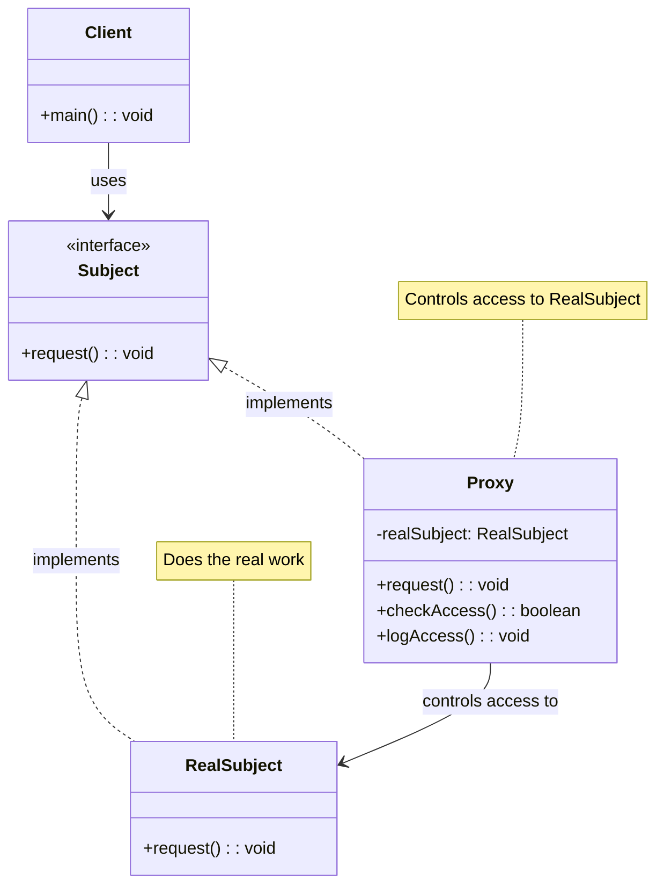
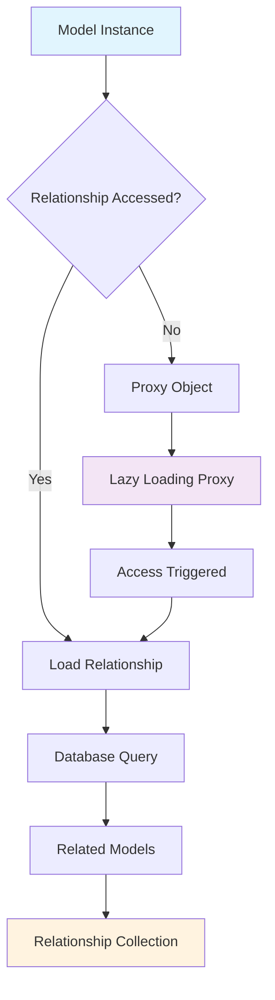
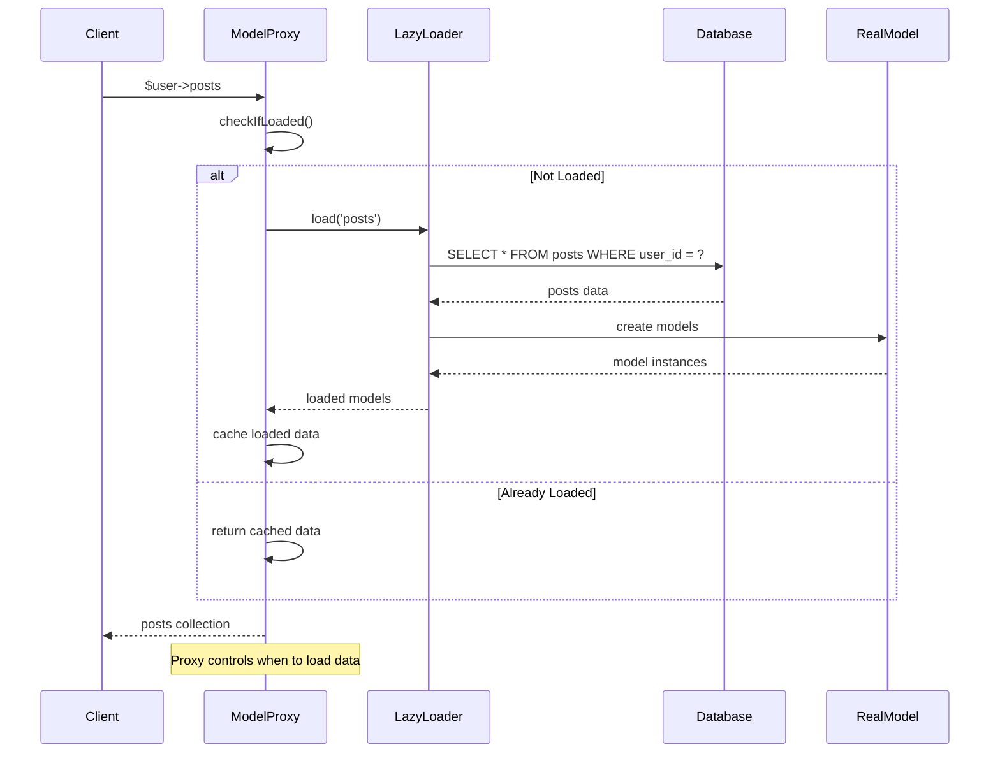

# Proxy Pattern

## Overview

Provide a surrogate or placeholder for another object to control access to it. The Proxy pattern provides a substitute or placeholder for another object to control access to it.

## Architecture Diagram

### Proxy Pattern Structure



### Laravel Lazy Loading Proxy



### Proxy Access Flow



## Implementation in Laravel

### 1. Eloquent Relationship Lazy Loading

Laravel uses proxy-like behavior for lazy loading relationships:

```php
// Illuminate\Database\Eloquent\Model.php
class Model implements ArrayAccess, Arrayable, Jsonable, JsonSerializable, QueueableEntity, UrlRoutable
{
    public function __get($key)
    {
        return $this->getAttribute($key);
    }
    
    public function getAttribute($key)
    {
        if (! $key) {
            return;
        }
        
        // If the attribute exists in the attribute array or has a "get" mutator we will
        // get the attribute's value. Otherwise, we will proceed as if the developers
        // are asking for a relationship's value. This covers both types of values.
        if (array_key_exists($key, $this->getAttributes()) ||
            array_key_exists($key, $this->getCasts()) ||
            $this->hasGetMutator($key) ||
            $this->hasAttributeMutator($key)) {
            return $this->getAttributeValue($key);
        }
        
        // Here we will determine if the model base class itself contains this given key
        // since we don't want to treat any of those methods as relationships because
        // they are all intended as helper methods and none of these are relations.
        if (method_exists(self::class, $key)) {
            return;
        }
        
        return $this->getRelationValue($key);
    }
    
    public function getRelationValue($key)
    {
        // If the key already exists in the relationships array, it just means the
        // relationship has already been loaded, so we'll just return it out of
        // here because there is no need to query within the relations twice.
        if ($this->relationLoaded($key)) {
            return $this->relations[$key];
        }
        
        // If the "attribute" exists as a method on the model, we will just assume
        // it is a relationship and will load and return results from the query
        // and hydrate the relationship's value on the "relationships" array.
        if (method_exists($this, $key) ||
            (static::$relationResolvers[get_class($this)][$key] ?? null)) {
            return $this->getRelationshipFromMethod($key);
        }
    }
}
```

### 2. Service Container Proxy

```php
// Laravel's service container acts as a proxy for service resolution
class Container implements ArrayAccess, ContainerContract
{
    public function make($abstract, array $parameters = [])
    {
        return $this->resolve($abstract, $parameters);
    }
    
    protected function resolve($abstract, $parameters = [], $raiseEvents = true)
    {
        $abstract = $this->getAlias($abstract);
        
        // If an instance of the type is currently being managed as a singleton we'll
        // just return an existing instance instead of instantiating new instances
        // so the developer can keep using the same objects instance every time.
        if (isset($this->instances[$abstract]) && ! $needsContextualBuild) {
            return $this->instances[$abstract];
        }
        
        $this->with[] = $parameters;
        
        $concrete = $this->getConcrete($abstract);
        
        // We're ready to instantiate an instance of the concrete type registered for
        // the binding. This will instantiate the types, as well as resolve any of
        // its "nested" dependencies recursively until all have gotten resolved.
        if ($this->isBuildable($concrete, $abstract)) {
            $object = $this->build($concrete);
        } else {
            $object = $this->make($concrete);
        }
        
        // If the requested type is registered as a singleton we'll want to cache off
        // the instances in "memory" so we can return it later without creating an
        // entirely new instance of an object on each subsequent request for it.
        if ($this->isShared($abstract) && ! $needsContextualBuild) {
            $this->instances[$abstract] = $object;
        }
        
        if ($raiseEvents) {
            $this->fireResolvingCallbacks($abstract, $object);
        }
        
        // Before returning, we will also set the resolved flag to "true" and pop off
        // the parameter overrides for this build. After those two things are done
        // we will be ready to return back the fully constructed class instance.
        $this->resolved[$abstract] = true;
        
        array_pop($this->with);
        
        return $object;
    }
}
```

### 3. Cache Proxy

```php
// Cache proxy for controlling access to cache operations
class CacheProxy implements Store
{
    protected $store;
    protected $prefix;
    
    public function __construct(Store $store, $prefix = '')
    {
        $this->store = $store;
        $this->prefix = $prefix;
    }
    
    public function get($key)
    {
        return $this->store->get($this->prefixKey($key));
    }
    
    public function put($key, $value, $seconds)
    {
        return $this->store->put($this->prefixKey($key), $value, $seconds);
    }
    
    public function forget($key)
    {
        return $this->store->forget($this->prefixKey($key));
    }
    
    protected function prefixKey($key)
    {
        return $this->prefix.$key;
    }
}
```

### 4. Database Connection Proxy

```php
// Database connection proxy for query logging and monitoring
class DatabaseProxy
{
    protected $connection;
    protected $logger;
    
    public function __construct($connection, $logger)
    {
        $this->connection = $connection;
        $this->logger = $logger;
    }
    
    public function select($query, $bindings = [], $useReadPdo = true)
    {
        $start = microtime(true);
        
        try {
            $result = $this->connection->select($query, $bindings, $useReadPdo);
            
            $this->logQuery($query, $bindings, microtime(true) - $start);
            
            return $result;
        } catch (\Exception $e) {
            $this->logError($query, $bindings, $e);
            throw $e;
        }
    }
    
    protected function logQuery($query, $bindings, $time)
    {
        $this->logger->info('Database Query', [
            'query' => $query,
            'bindings' => $bindings,
            'time' => $time
        ]);
    }
    
    protected function logError($query, $bindings, $exception)
    {
        $this->logger->error('Database Error', [
            'query' => $query,
            'bindings' => $bindings,
            'error' => $exception->getMessage()
        ]);
    }
}
```