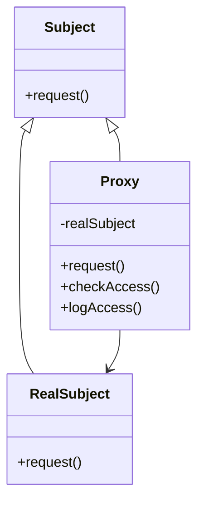
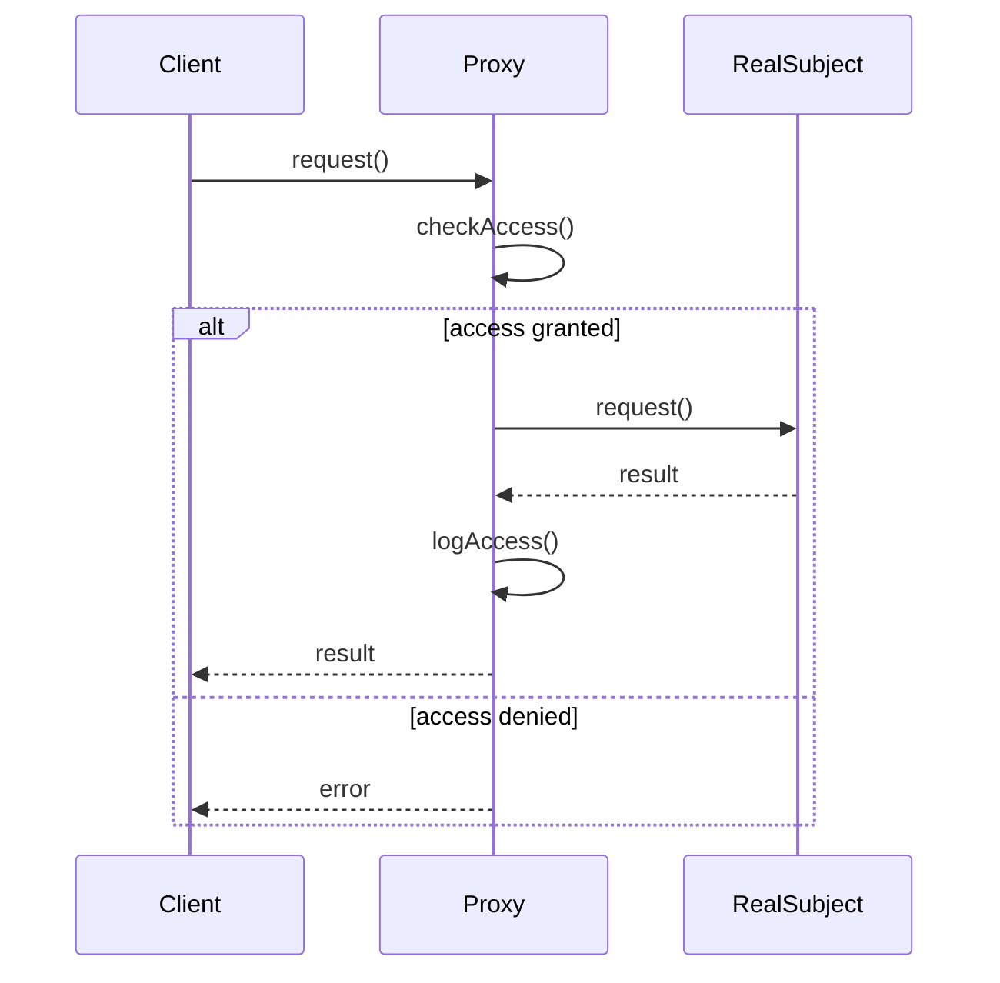

# 代理模式 (Proxy Pattern)

## 概述

代理模式为其他对象提供一种代理以控制对这个对象的访问。代理对象在客户端和目标对象之间起到中介作用，可以在不改变目标对象的情况下，扩展目标对象的功能。

## 问题场景

在Laravel应用中，我们经常需要：
- 控制对昂贵资源的访问（如数据库连接、外部API）
- 实现延迟加载（Lazy Loading）
- 添加访问控制和权限验证
- 缓存昂贵操作的结果
- 记录访问日志和统计信息

## 解决方案

代理模式通过创建代理类来间接访问目标对象，代理类与目标对象实现相同的接口，在代理类中可以添加额外的控制逻辑。

## UML类图



## Laravel实现

### 1. 虚拟代理（延迟加载）示例

```php
<?php

namespace App\Patterns\Proxy;

// 服务接口
interface ImageServiceInterface
{
    public function display(): string;
    public function getSize(): array;
    public function getMetadata(): array;
}

// 真实的图片服务（昂贵的资源）
class RealImageService implements ImageServiceInterface
{
    private string $filename;
    private array $imageData;
    
    public function __construct(string $filename)
    {
        $this->filename = $filename;
        $this->loadImage();
    }
    
    private function loadImage(): void
    {
        // 模拟昂贵的图片加载操作
        echo "Loading image: {$this->filename}\n";
        sleep(2); // 模拟加载时间
        
        $this->imageData = [
            'filename' => $this->filename,
            'size' => [800, 600],
            'format' => 'JPEG',
            'data' => 'binary_image_data...'
        ];
    }
    
    public function display(): string
    {
        return "filename}' alt='Image' />";
    }
    
    public function getSize(): array
    {
        return $this->imageData['size'];
    }
    
    public function getMetadata(): array
    {
        return [
            'filename' => $this->imageData['filename'],
            'format' => $this->imageData['format'],
            'size' => $this->imageData['size']
        ];
    }
}

// 虚拟代理（延迟加载）
class VirtualImageProxy implements ImageServiceInterface
{
    private string $filename;
    private ?RealImageService $realImage = null;
    
    public function __construct(string $filename)
    {
        $this->filename = $filename;
    }
    
    private function getRealImage(): RealImageService
    {
        if ($this->realImage === null) {
            $this->realImage = new RealImageService($this->filename);
        }
        
        return $this->realImage;
    }
    
    public function display(): string
    {
        return $this->getRealImage()->display();
    }
    
    public function getSize(): array
    {
        return $this->getRealImage()->getSize();
    }
    
    public function getMetadata(): array
    {
        return $this->getRealImage()->getMetadata();
    }
}
```

### 2. 保护代理（权限控制）示例

```php
<?php

namespace App\Patterns\Proxy;

// 用户服务接口
interface UserServiceInterface
{
    public function getUserInfo(int $userId): array;
    public function updateUser(int $userId, array $data): bool;
    public function deleteUser(int $userId): bool;
}

// 真实的用户服务
class RealUserService implements UserServiceInterface
{
    public function getUserInfo(int $userId): array
    {
        // 模拟从数据库获取用户信息
        return [
            'id' => $userId,
            'name' => 'User ' . $userId,
            'email' => "user{$userId}@example.com",
            'role' => 'user'
        ];
    }
    
    public function updateUser(int $userId, array $data): bool
    {
        // 模拟更新用户信息
        echo "Updating user {$userId} with data: " . json_encode($data) . "\n";
        return true;
    }
    
    public function deleteUser(int $userId): bool
    {
        // 模拟删除用户
        echo "Deleting user {$userId}\n";
        return true;
    }
}

// 保护代理（权限控制）
class ProtectionUserProxy implements UserServiceInterface
{
    private RealUserService $userService;
    private array $currentUser;
    
    public function __construct(array $currentUser)
    {
        $this->userService = new RealUserService();
        $this->currentUser = $currentUser;
    }
    
    private function hasPermission(string $action, int $targetUserId = null): bool
    {
        // 管理员有所有权限
        if ($this->currentUser['role'] === 'admin') {
            return true;
        }
        
        // 普通用户只能查看和修改自己的信息
        if ($action === 'read') {
            return true; // 所有用户都可以读取
        }
        
        if ($action === 'update' && $targetUserId === $this->currentUser['id']) {
            return true;
        }
        
        if ($action === 'delete') {
            return false; // 普通用户不能删除
        }
        
        return false;
    }
    
    public function getUserInfo(int $userId): array
    {
        if (!$this->hasPermission('read', $userId)) {
            throw new \Exception('Access denied: Cannot read user information');
        }
        
        return $this->userService->getUserInfo($userId);
    }
    
    public function updateUser(int $userId, array $data): bool
    {
        if (!$this->hasPermission('update', $userId)) {
            throw new \Exception('Access denied: Cannot update user information');
        }
        
        return $this->userService->updateUser($userId, $data);
    }
    
    public function deleteUser(int $userId): bool
    {
        if (!$this->hasPermission('delete', $userId)) {
            throw new \Exception('Access denied: Cannot delete user');
        }
        
        return $this->userService->deleteUser($userId);
    }
}
```

### 3. 缓存代理示例

```php
<?php

namespace App\Patterns\Proxy;

// 数据服务接口
interface DataServiceInterface
{
    public function getData(string $key): ?array;
    public function setData(string $key, array $data): bool;
}

// 真实的数据服务（可能是昂贵的数据库操作）
class RealDataService implements DataServiceInterface
{
    public function getData(string $key): ?array
    {
        // 模拟昂贵的数据库查询
        echo "Querying database for key: {$key}\n";
        sleep(1); // 模拟查询时间
        
        // 模拟返回数据
        return [
            'key' => $key,
            'value' => 'data_for_' . $key,
            'timestamp' => time()
        ];
    }
    
    public function setData(string $key, array $data): bool
    {
        // 模拟数据库写入
        echo "Writing to database: {$key} = " . json_encode($data) . "\n";
        sleep(0.5); // 模拟写入时间
        
        return true;
    }
}

// 缓存代理
class CachingDataProxy implements DataServiceInterface
{
    private RealDataService $dataService;
    private array $cache = [];
    private int $ttl;
    
    public function __construct(int $ttl = 300)
    {
        $this->dataService = new RealDataService();
        $this->ttl = $ttl;
    }
    
    public function getData(string $key): ?array
    {
        // 检查缓存
        if (isset($this->cache[$key])) {
            $cachedData = $this->cache[$key];
            
            // 检查是否过期
            if (time() - $cachedData['cached_at'] < $this->ttl) {
                echo "Cache hit for key: {$key}\n";
                return $cachedData['data'];
            } else {
                // 缓存过期，清除
                unset($this->cache[$key]);
            }
        }
        
        // 缓存未命中，从真实服务获取数据
        echo "Cache miss for key: {$key}\n";
        $data = $this->dataService->getData($key);
        
        if ($data !== null) {
            // 存储到缓存
            $this->cache[$key] = [
                'data' => $data,
                'cached_at' => time()
            ];
        }
        
        return $data;
    }
    
    public function setData(string $key, array $data): bool
    {
        $result = $this->dataService->setData($key, $data);
        
        if ($result) {
            // 更新缓存
            $this->cache[$key] = [
                'data' => $data,
                'cached_at' => time()
            ];
        }
        
        return $result;
    }
    
    public function clearCache(string $key = null): void
    {
        if ($key === null) {
            $this->cache = [];
            echo "All cache cleared\n";
        } else {
            unset($this->cache[$key]);
            echo "Cache cleared for key: {$key}\n";
        }
    }
}
```

### 4. 远程代理示例

```php
<?php

namespace App\Patterns\Proxy;

// API服务接口
interface ApiServiceInterface
{
    public function request(string $endpoint, array $params = []): array;
}

// 真实的API服务
class RealApiService implements ApiServiceInterface
{
    private string $baseUrl;
    private array $headers;
    
    public function __construct(string $baseUrl, array $headers = [])
    {
        $this->baseUrl = $baseUrl;
        $this->headers = $headers;
    }
    
    public function request(string $endpoint, array $params = []): array
    {
        $url = $this->baseUrl . '/' . $endpoint;
        
        // 模拟HTTP请求
        echo "Making HTTP request to: {$url}\n";
        
        // 使用Guzzle或其他HTTP客户端
        $response = \Http::withHeaders($this->headers)->get($url, $params);
        
        return $response->json();
    }
}

// 远程代理（带重试和错误处理）
class RemoteApiProxy implements ApiServiceInterface
{
    private RealApiService $apiService;
    private int $maxRetries;
    private int $retryDelay;
    
    public function __construct(string $baseUrl, array $headers = [], int $maxRetries = 3, int $retryDelay = 1)
    {
        $this->apiService = new RealApiService($baseUrl, $headers);
        $this->maxRetries = $maxRetries;
        $this->retryDelay = $retryDelay;
    }
    
    public function request(string $endpoint, array $params = []): array
    {
        $attempts = 0;
        
        while ($attempts < $this->maxRetries) {
            try {
                return $this->apiService->request($endpoint, $params);
            } catch (\Exception $e) {
                $attempts++;
                
                if ($attempts >= $this->maxRetries) {
                    throw new \Exception("API request failed after {$this->maxRetries} attempts: " . $e->getMessage());
                }
                
                echo "Request failed (attempt {$attempts}), retrying in {$this->retryDelay} seconds...\n";
                sleep($this->retryDelay);
            }
        }
        
        return [];
    }
}
```

## 使用示例

### 虚拟代理使用

```php
<?php

// 创建图片代理（此时不会加载图片）
$image1 = new VirtualImageProxy('large_image_1.jpg');
$image2 = new VirtualImageProxy('large_image_2.jpg');
$image3 = new VirtualImageProxy('large_image_3.jpg');

echo "Images created (but not loaded yet)\n";

// 只有在实际使用时才会加载图片
echo $image1->display(); // 此时才加载 large_image_1.jpg
echo $image2->getSize(); // 此时才加载 large_image_2.jpg
// image3 从未被使用，所以不会被加载
```

### 保护代理使用

```php
<?php

// 普通用户
$normalUser = ['id' => 1, 'role' => 'user'];
$userProxy = new ProtectionUserProxy($normalUser);

try {
    // 可以读取用户信息
    $userInfo = $userProxy->getUserInfo(1);
    echo "User info: " . json_encode($userInfo) . "\n";
    
    // 可以更新自己的信息
    $userProxy->updateUser(1, ['name' => 'New Name']);
    
    // 不能删除用户（会抛出异常）
    $userProxy->deleteUser(1);
} catch (\Exception $e) {
    echo "Error: " . $e->getMessage() . "\n";
}

// 管理员用户
$adminUser = ['id' => 2, 'role' => 'admin'];
$adminProxy = new ProtectionUserProxy($adminUser);

// 管理员可以执行所有操作
$adminProxy->deleteUser(1); // 成功
```

### 缓存代理使用

```php
<?php

$dataProxy = new CachingDataProxy(60); // 60秒TTL

// 第一次请求（缓存未命中）
$data1 = $dataProxy->getData('user:123');

// 第二次请求相同数据（缓存命中）
$data2 = $dataProxy->getData('user:123');

// 更新数据
$dataProxy->setData('user:123', ['name' => 'Updated Name']);

// 清除缓存
$dataProxy->clearCache('user:123');
```

### 远程代理使用

```php
<?php

$apiProxy = new RemoteApiProxy(
    'https://api.example.com',
    ['Authorization' => 'Bearer token123'],
    3, // 最大重试次数
    2  // 重试延迟（秒）
);

try {
    $result = $apiProxy->request('users', ['page' => 1, 'limit' => 10]);
    echo "API Response: " . json_encode($result) . "\n";
} catch (\Exception $e) {
    echo "API Error: " . $e->getMessage() . "\n";
}
```

## Laravel中的实际应用

### 1. Eloquent关系的延迟加载

```php
<?php

// Laravel的关系延迟加载就是虚拟代理模式
class User extends Model
{
    public function posts()
    {
        return $this->hasMany(Post::class);
    }
}

$user = User::find(1);
// 此时posts关系还没有被加载（虚拟代理）

$posts = $user->posts; 
// 只有在访问时才会执行查询（代理模式的延迟加载）
```

### 2. 缓存系统

```php
<?php

// Laravel的缓存系统使用了代理模式
class CacheManager
{
    public function remember($key, $ttl, Closure $callback)
    {
        $value = $this->get($key);
        
        if ($value === null) {
            $value = $callback();
            $this->put($key, $value, $ttl);
        }
        
        return $value;
    }
}

// 使用示例
$users = Cache::remember('users', 3600, function () {
    return User::all(); // 只有缓存未命中时才执行
});
```

### 3. 队列代理

```php
<?php

// Laravel的队列系统也使用了代理模式
class QueueProxy
{
    public function push($job)
    {
        // 代理实际的队列操作
        return $this->connection->push($job);
    }
}

// 使用示例
Queue::push(new SendEmailJob($user));
// 实际的邮件发送被代理到队列系统中
```

### 4. 门面模式（Facade）

```php
<?php

// Laravel的Facade也是代理模式的应用
class Cache extends Facade
{
    protected static function getFacadeAccessor()
    {
        return 'cache'; // 代理到实际的缓存服务
    }
}

// 使用时看起来像静态调用，实际上是代理
Cache::put('key', 'value', 3600);
```

## 时序图



## 代理模式的类型

### 1. 虚拟代理（Virtual Proxy）
- 延迟创建昂贵的对象
- 只有在真正需要时才创建实际对象

### 2. 保护代理（Protection Proxy）
- 控制对原始对象的访问
- 提供不同级别的访问权限

### 3. 远程代理（Remote Proxy）
- 为远程对象提供本地代表
- 隐藏网络通信的复杂性

### 4. 缓存代理（Caching Proxy）
- 缓存昂贵操作的结果
- 提高系统性能

## 优点

1. **控制访问**：可以在不修改目标对象的情况下控制访问
2. **延迟初始化**：可以延迟昂贵对象的创建
3. **增强功能**：可以在访问对象时添加额外的功能
4. **透明性**：客户端无需知道是否使用了代理

## 缺点

1. **增加复杂性**：引入了额外的抽象层
2. **性能开销**：代理调用可能带来性能损失
3. **间接性**：增加了系统的间接性

## 适用场景

1. **需要控制对象访问时**
2. **需要延迟加载昂贵资源时**
3. **需要为远程对象提供本地代理时**
4. **需要添加访问日志或缓存时**

## 与其他模式的关系

- **装饰器模式**：代理控制访问，装饰器增强功能
- **适配器模式**：代理与目标对象接口相同，适配器改变接口
- **外观模式**：代理代表单个对象，外观代表子系统

代理模式在Laravel中应用非常广泛，是构建高性能、安全应用的重要设计模式。